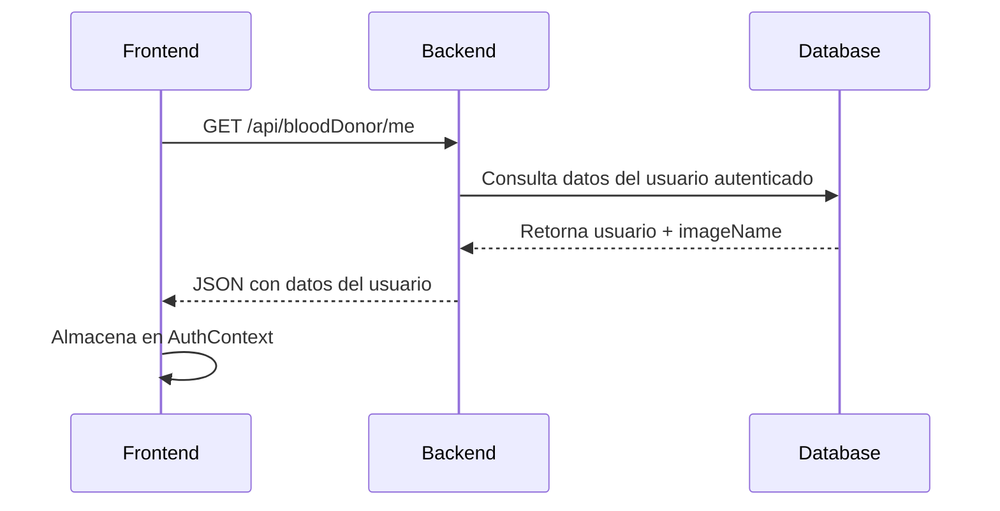
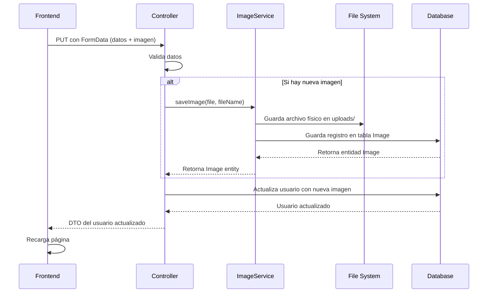

# Documentación del CRUD de Edición de Perfil

## 📋 Descripción General

El sistema de edición de perfil implementa un CRUD completo (Create, Read, Update, Delete) gestionado completamente desde el **backend**. Tanto los datos del usuario como las imágenes de perfil se almacenan y sirven desde el servidor.

## 🏗️ Arquitectura

### Backend

#### Componentes Principales

1. **Controllers**
   - [`BloodDonorController.java`](file:///e:/blood4life/backend/src/main/java/com/xiojuandawt/blood4life/controllers/BloodDonorController.java)
   - [`HospitalController.java`](file:///e:/blood4life/backend/src/main/java/com/xiojuandawt/blood4life/controllers/HospitalController.java)

2. **Services**
   - [`ImageService.java`](file:///e:/blood4life/backend/src/main/java/com/xiojuandawt/blood4life/services/ImageService.java)
   - `BloodDonorService.java`
   - `HospitalService.java`

3. **Configuration**
   - [`WebConfig.java`](file:///e:/blood4life/backend/src/main/java/com/xiojuandawt/blood4life/config/WebConfig.java) - Configuración para servir archivos estáticos

### Frontend

- [`EditProfileModal.tsx`](file:///e:/blood4life/frontend/src/components/EditProfileModal/EditProfileModal.tsx) - Componente principal de edición

## 🔄 Flujo de Datos

### 1. Obtención de Datos del Usuario (Read)

#### Endpoints
```
GET /api/bloodDonor/me
GET /api/hospital/me
```

#### Proceso


#### Respuesta del Backend
```json
{
  "id": 1,
  "dni": "12345678A",
  "firstName": "Juan",
  "lastName": "Pérez",
  "email": "juan@example.com",
  "imageName": "uuid-12345.png",
  ...
}
```

### 2. Carga de Imagen de Perfil

#### URL de la Imagen
```typescript
// Frontend construye la URL
const imageUrl = `/images/${user.imageName}`;
// Ejemplo: /images/uuid-12345.png
```

#### Configuración del Backend

**WebConfig.java** - Mapeo de recursos estáticos:
```java
@Configuration
public class WebConfig implements WebMvcConfigurer {
    @Override
    public void addResourceHandlers(ResourceHandlerRegistry registry) {
        // Mapea /images/** al directorio uploads/
        registry.addResourceHandler("/images/**")
                .addResourceLocations("file:uploads/");
    }
}
```

#### Flujo de Servicio de Imágenes
```
Solicitud: GET http://localhost:8080/images/uuid-12345.png
           ↓
WebConfig: Mapea a file:uploads/uuid-12345.png
           ↓
Spring Boot: Lee archivo del sistema de archivos
           ↓
Respuesta: Imagen en bytes
```

### 3. Actualización de Perfil (Update)

#### Endpoints
```
PUT /api/bloodDonor/{id}
PUT /api/hospital
```

#### Proceso Completo



#### Ejemplo de Código - ImageService

```java
@Service
public class ImageService {
    private final String uploadDir = "uploads/";
    
    public Image saveImage(MultipartFile file, String fileName) throws IOException {
        // 1. Construir ruta del archivo
        Path filepath = Paths.get(uploadDir + fileName);
        
        // 2. Crear directorios si no existen
        Files.createDirectories(filepath.getParent());
        
        // 3. Escribir archivo en disco
        Files.write(filepath, file.getBytes());
        
        // 4. Crear registro en BD
        Image image = new Image(fileName);
        return imageRepository.save(image);
    }
}
```

#### Ejemplo de Código - Controller

```java
@PutMapping("/{id}")
public ResponseEntity<?> updateBloodDonor(
    @PathVariable Integer id,
    @RequestParam("firstName") String firstName,
    // ... otros campos
    @RequestParam(value = "image", required = false) MultipartFile imageFile) {
    
    BloodDonor donor = findById(id);
    
    // Actualizar campos básicos
    donor.setFirstName(firstName);
    // ...
    
    // Manejar imagen si se proporcionó
    if (imageFile != null && !imageFile.isEmpty()) {
        String fileName = UUID.randomUUID().toString() + extension;
        Image imageEntity = imageService.saveImage(imageFile, fileName);
        donor.setImage(imageEntity);
    }
    
    // Guardar cambios
    return ResponseEntity.ok(bloodDonorService.update(donor, id));
}
```

### 4. Cambio de Contraseña

#### Endpoint Adicional
```
POST /api/bloodDonor/change-password
POST /api/hospital/change-password
```

#### Validaciones Aplicadas
- ✅ Contraseña actual correcta
- ✅ Nueva contraseña mínimo 8 caracteres, máximo 32
- ✅ Contiene al menos una minúscula
- ✅ Contiene al menos una mayúscula
- ✅ Contiene al menos un número
- ✅ Sin espacios
- ✅ No más de 3 caracteres repetidos consecutivos

## 📁 Estructura de Directorios

### Backend
```
blood4life/backend/
├── uploads/                    # Directorio de imágenes (físico)
│   ├── uuid-1.png
│   ├── uuid-2.jpg
│   └── ...
├── src/main/java/
│   └── com/xiojuandawt/blood4life/
│       ├── controllers/
│       │   ├── BloodDonorController.java
│       │   └── HospitalController.java
│       ├── services/
│       │   └── ImageService.java
│       └── config/
│           └── WebConfig.java
```

### Base de Datos

#### Tabla: `image`
```sql
CREATE TABLE image (
    id INT PRIMARY KEY AUTO_INCREMENT,
    name VARCHAR(255) NOT NULL
);
```

#### Tabla: `blood_donor`
```sql
CREATE TABLE blood_donor (
    id INT PRIMARY KEY AUTO_INCREMENT,
    dni VARCHAR(9),
    first_name VARCHAR(100),
    last_name VARCHAR(100),
    email VARCHAR(100),
    password VARCHAR(255),
    image_id INT,
    FOREIGN KEY (image_id) REFERENCES image(id)
);
```

## 🔐 Seguridad

### Configuración de Spring Security

```java
// SecurityConfig.java
http.authorizeHttpRequests(auth -> auth
    .requestMatchers("/images/**").permitAll()  // Imágenes públicas
    .requestMatchers("/api/bloodDonor/me").authenticated()
    .requestMatchers("/api/bloodDonor/{id}").authenticated()
    // ...
);
```

### Protección de Endpoints
- Los endpoints de lectura y actualización requieren autenticación
- Solo el usuario autenticado puede modificar su propio perfil
- Las contraseñas se encriptan con BCrypt antes de guardarse
- La validación de contraseña actual previene cambios no autorizados

## 🎯 Flujo Completo de Usuario

### Editar Perfil con Imagen Nueva

1. **Usuario abre modal de edición**
   ```typescript
   // Frontend carga datos actuales
   GET /api/bloodDonor/me → respuesta incluye imageName
   ```

2. **Usuario modifica datos y selecciona nueva imagen**
   ```typescript
   // Frontend prepara FormData
   const formData = new FormData();
   formData.append('firstName', 'Nuevo Nombre');
   formData.append('image', selectedFile);
   ```

3. **Usuario guarda cambios**
   ```typescript
   PUT /api/bloodDonor/1 con FormData
   ```

4. **Backend procesa**
   - Guarda imagen en `uploads/uuid-nuevo.png`
   - Crea registro en tabla `image`
   - Actualiza `blood_donor` con nueva `image_id`
   - Retorna datos actualizados

5. **Frontend recarga**
   - Página se recarga
   - Nueva imagen se carga desde `/images/uuid-nuevo.png`

## ✅ Verificación del Flujo

### Comprobar que las imágenes vienen del backend:

1. **Inspeccionar en DevTools:**
   ```
   Network → Filter: images
   Request URL: http://localhost:8080/images/uuid-12345.png
   Status: 200
   ```

2. **Verificar directorio físico:**
   ```bash
   ls backend/uploads/
   # Debe mostrar los archivos de imagen
   ```

3. **Verificar base de datos:**
   ```sql
   SELECT * FROM image;
   SELECT id, first_name, image_id FROM blood_donor;
   ```

## 📝 Notas Importantes

- ✅ **Todas las imágenes se almacenan en el servidor**, no en el frontend
- ✅ **El directorio `uploads/` debe tener permisos de escritura**
- ✅ **Los nombres de archivo se generan con UUID** para evitar conflictos
- ✅ **Las imágenes se sirven directamente desde Spring Boot**, no desde un CDN
- ✅ **El cambio de contraseña es un endpoint separado** con validaciones adicionales

## 🔧 Mantenimiento

### Limpieza de Imágenes Huérfanas

Cuando un usuario actualiza su imagen, la imagen anterior no se elimina automáticamente. Considerar implementar:

1. **Eliminación al actualizar:**
   ```java
   if (oldImage != null) {
       Files.deleteIfExists(Paths.get(uploadDir + oldImage.getName()));
       imageRepository.delete(oldImage);
   }
   ```

2. **Tarea programada de limpieza:**
   - Buscar imágenes en `uploads/` no referenciadas en BD
   - Eliminar archivos huérfanos periódicamente

## 🎨 Frontend - EditProfileModal

### Características Principales

- ✅ Precarga de datos del usuario autenticado
- ✅ Vista previa de imagen antes de guardar
- ✅ Validación de formulario
- ✅ Sección colapsable para cambio de contraseña
- ✅ Mensajes de éxito/error
- ✅ Recarga automática después de guardar exitosamente

### Experiencia de Usuario

1. Usuario ve sus datos actuales precargados
2. Puede cambiar foto haciendo clic en "Cambiar foto"
3. Ve preview inmediato de la nueva foto seleccionada
4. Opcionalmente puede expandir "Cambiar contraseña"
5. Al guardar, recibe feedback inmediato
6. Página se recarga mostrando los cambios aplicados

---

**Última actualización:** 11 de diciembre de 2024  
**Versión:** 1.0
