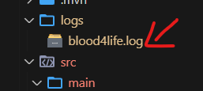
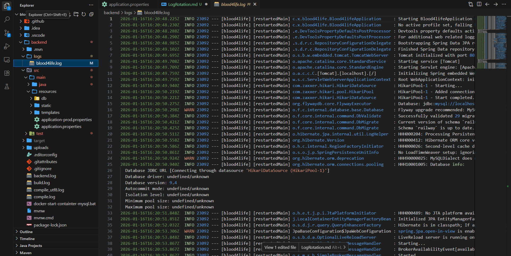

# Configuración de Rotación de Logs


## Configuración Implementada en application.properties

Se han añadido las siguientes directivas al archivo `src/main/resources/application.properties` para habilitar y configurar la política de rotación de logs utilizando Logback (el sistema de logging por defecto en Spring Boot):

```properties
# File where the logs will be stored
logging.file.name=logs/blood4life.log

# Log pattern name for rotated logs (daily + index)
logging.logback.rollingpolicy.file-name-pattern=logs/blood4life.%d{yyyy-MM-dd}.%i.log

# Size-based rotation (max 10MB)
logging.logback.rollingpolicy.max-file-size=10MB

# Number of days to keep logs (14 days)
logging.logback.rollingpolicy.max-history=14

# Total size of logs (100MB)
logging.logback.rollingpolicy.total-size-cap=100MB
```

## Detalle de los Parámetros

A continuación se detalla la función técnica de cada propiedad configurada:

*   **`logging.file.name`**: Define el archivo de salida "activo". Todos los logs actuales se escriben en `logs/blood4life.log`. Este es siempre el archivo más reciente.

*   **`logging.logback.rollingpolicy.file-name-pattern`**: Establece el patrón de nombrado para los archivos archivados (rotados).

*   **`logging.logback.rollingpolicy.max-file-size`**: Establece un límite de **10MB** por archivo individual. Si el archivo activo alcanza este tamaño, se cierra, se renombra siguiendo el patrón anterior, y se comienza uno nuevo, incluso si el día no ha terminado.

*   **`logging.logback.rollingpolicy.max-history`**: Define la política de retención temporal. Se guardarán los archivos de log de los últimos **14 días**. Los archivos más antiguos se eliminarán automáticamente.

*   **`logging.logback.rollingpolicy.total-size-cap`**: Establece un límite de almacenamiento global de **100MB** para todos los archivos de log archivados. Si la suma del tamaño de todos los logs excede este valor, se eliminarán los archivos más antiguos para liberar espacio, independientemente de si han cumplido los 14 días de retención o no.

## A continuación dejo una foto de la carpeta logs para que puedas ver como se van guardando los logs y otra foto del archivo de log.




