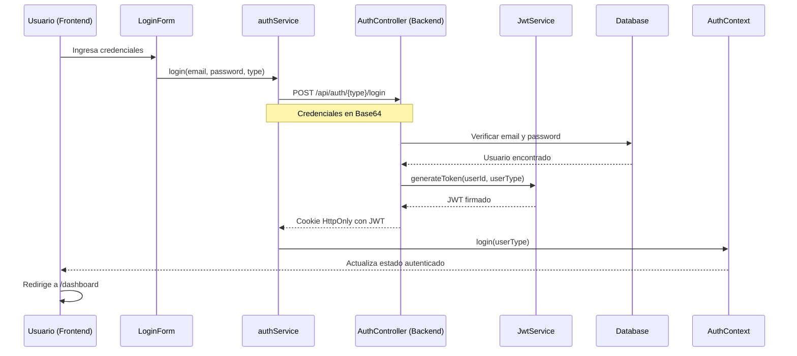

# Autenticación JWT en Blood4Life

## Introducción

El sistema de autenticación de Blood4Life utiliza **JSON Web Tokens (JWT)** para verificar la identidad de los usuarios y proteger las rutas de la aplicación. Este sistema soporta dos tipos de usuarios:
- **Donantes de Sangre (Blood Donors)**
- **Hospitales**

Cada tipo de usuario tiene sus propias credenciales y permisos específicos dentro del sistema.

## ¿Qué es JWT?

JSON Web Token (JWT) es un estándar abierto (RFC 7519) que define una forma compacta y autocontenida de transmitir información de forma segura entre partes como un objeto JSON. Esta información puede ser verificada y confiable porque está firmada digitalmente.

En Blood4Life, los JWT se utilizan para:
- Autenticar usuarios después del login
- Mantener sesiones sin estado (stateless)
- Proteger endpoints de la API
- Diferenciar entre tipos de usuarios (donantes vs hospitales)

## Arquitectura del Sistema de Autenticación

### Flujo General de Autenticación




### Ejemplo de Login de Hospital

El usuario selecciona el tipo "Hospital" y llena el formulario con sus credenciales:


## Flujo Detallado de Autenticación

### 1. Inicio de Sesión

El usuario accede a la página de login (`/login`) donde encuentra un formulario con los siguientes campos:
- **Correo electrónico**: Campo de texto para el email del usuario
- **Contraseña**: Campo de texto con opción para mostrar/ocultar
- **Tipo de usuario**: Selector de radio para elegir entre "Donante" u "Hospital"

### 2. Envío de Credenciales al Backend

Cuando el usuario pulsa "Enviar", el frontend (`LoginForm.tsx`) procesa el formulario:

```typescript
// LoginForm.tsx - Manejo del submit
const handleSubmit = async (e: React.FormEvent) => {
  e.preventDefault();
  setError(null);
  setIsLoading(true);

  try {
    await authService.login(formData.username, formData.password, userType);
    login(userType);
    navigate('/dashboard');
  } catch (err: any) {
    setError(err.response?.data?.error || 'Error al iniciar sesión');
  } finally {
    setIsLoading(false);
  }
};
```

El `authService` codifica las credenciales en **Base64** siguiendo el formato de autenticación básica HTTP:

```typescript
// authService.ts - Codificación de credenciales
export const authService = {
  login: async (email: string, password: string, type: 'bloodDonor' | 'hospital' | 'admin') => {
    const credentials = btoa(`${email}:${password}`); // Codificación Base64
    const response = await axios.post<LoginResponse>(
      `${API_URL}/auth/${type}/login`,
      {},
      {
        headers: {
          Authorization: `Basic ${credentials}`,
        },
        withCredentials: true // Crucial: permite recibir cookies
      }
    );
    return response.data;
  }
};
```

### 3. Verificación en el Backend

El `AuthController` recibe la petición y procesa las credenciales:

```java
// AuthController.java - Login de Donante
@PostMapping("/bloodDonor/login")
public ResponseEntity<?> loginBloodDonor(@RequestHeader("Authorization") String authHeader) {
  try {
    String[] credentials = extractCredentials(authHeader);
    String email = credentials[0];
    String password = credentials[1];

    Optional<BloodDonor> donorOpt = bloodDonorService.findByEmail(email);
    if (donorOpt.isEmpty() || !passwordEncoder.matches(password, donorOpt.get().getPassword())) {
      return errorResponse("Error. Ingrese credenciales válidas", HttpStatus.UNAUTHORIZED);
    }

    BloodDonor donor = donorOpt.get();
    String token = jwtService.generateToken(donor.getId(), "bloodDonor");
    
    // ... creación de cookie y respuesta
  }
}
```

El método `extractCredentials` decodifica las credenciales Base64:

```java
// AuthController.java - Extracción de credenciales
private String[] extractCredentials(String authHeader) {
  if (authHeader == null || !authHeader.startsWith("Basic ")) {
    throw new IllegalArgumentException("Missing or invalid Authorization header");
  }
  String base64Credentials = authHeader.substring("Basic ".length());
  String decodedString = new String(Base64.getDecoder().decode(base64Credentials));
  if (!decodedString.contains(":")) {
    throw new IllegalArgumentException("Invalid Basic Auth format");
  }
  return decodedString.split(":", 2);
}
```

### 4. Generación del JWT

Si las credenciales son válidas, el `JwtServiceImpl` genera un token JWT:

```java
// JwtServiceImpl.java - Generación del token
@Override
public String generateToken(Integer EntityId, String entityType) {
  Map<String, Object> claims = new HashMap<>();
  claims.put("id", EntityId);      // ID del usuario
  claims.put("type", entityType);  // Tipo: "bloodDonor" o "hospital"

  return Jwts.builder()
    .claims(claims)
    .issuedAt(new Date(System.currentTimeMillis()))
    .expiration(new Date(System.currentTimeMillis() + EXPIRATION_TIME)) // 1 hora
    .signWith(this.getSigningKey(), Jwts.SIG.HS256)
    .compact();
}

private SecretKey getSigningKey() {
  return Keys.hmacShaKeyFor(this.SECRET_KEY.getBytes());
}
```

**Componentes del Token:**
- **Claims (payload)**: Contiene `id` (ID del usuario) y `type` (tipo de usuario)
- **issuedAt**: Fecha y hora de emisión del token
- **expiration**: Fecha y hora de expiración (1 hora desde la emisión)
- **Firma**: Generada usando HMAC-SHA256 con la clave secreta

La clave secreta se define en `application.properties`:
```properties
application.security.jwt.secret-key=trabajodexiomarayjuanotoguapoy...
```

### 5. Envío de la Cookie JWT

El backend crea una cookie **HttpOnly** con el token y la envía al cliente:

```java
// AuthController.java - Creación de la cookie JWT
ResponseCookie jwtCookie = ResponseCookie.from("jwt", token)
    .httpOnly(true)        // No accesible desde JavaScript
    .secure(false)         // Debería ser true en producción (HTTPS)
    .path("/")            // Disponible en toda la aplicación
    .maxAge(24 * 60 * 60) // 24 horas
    .sameSite("Lax")      // Protección CSRF
    .build();

Map<String, Object> response = new HashMap<>();
response.put("status", "OK");
response.put("message", "Login con éxito");

return ResponseEntity.ok()
    .header(HttpHeaders.SET_COOKIE, jwtCookie.toString())
    .body(response);
```

**Propiedades de la Cookie:**
- `httpOnly: true` - Previene acceso desde JavaScript (protección XSS)
- `secure: false` - Permite HTTP en desarrollo (debe ser `true` en producción con HTTPS)
- `path: "/"` - Cookie disponible en todas las rutas
- `maxAge: 24h` - Duración de la cookie en el navegador
- `sameSite: "Lax"` - Protección contra CSRF

### 6. Almacenamiento y Gestión en el Frontend

El navegador almacena automáticamente la cookie JWT. El `AuthContext` gestiona el estado de autenticación:

```typescript
// AuthContext.tsx - Gestión del estado de autenticación
export const AuthProvider: React.FC<{ children: ReactNode }> = ({ children }) => {
  const [userType, setUserType] = useState<'bloodDonor' | 'hospital' | 'admin' | null>(null);
  const [isAuthenticated, setIsAuthenticated] = useState(false);
  const [isLoading, setIsLoading] = useState(true);

  // Verificar autenticación al cargar la aplicación
  useEffect(() => {
    const checkAuth = async () => {
      try {
        await axiosInstance.get('/bloodDonor/me');
        setUserType('bloodDonor');
        setIsAuthenticated(true);
      } catch (e) {
        setIsAuthenticated(false);
        setUserType(null);
      } finally {
        setIsLoading(false);
      }
    };
    checkAuth();
  }, []);

  const login = (type: 'bloodDonor' | 'hospital' | 'admin') => {
    setUserType(type);
    setIsAuthenticated(true);
  };
  
  // ...
};
```

### 7. Validación del JWT en Peticiones Subsiguientes

Cada vez que el frontend realiza una petición a una ruta protegida, el navegador envía automáticamente la cookie JWT. El `JwtAuthFilter` intercepta la petición:

```java
// JwtAuthFilter.java - Filtro de autenticación
@Override
protected void doFilterInternal(
    HttpServletRequest request,
    HttpServletResponse response,
    FilterChain chain) throws ServletException, IOException {

  String token = null;

  // Extraer token de la cookie
  if (request.getCookies() != null) {
    token = Arrays.stream(request.getCookies())
        .filter(cookie -> "jwt".equals(cookie.getName()))
        .map(Cookie::getValue)
        .findFirst()
        .orElse(null);
  }

  // Si no hay token, continuar sin autenticación
  if (token == null) {
    chain.doFilter(request, response);
    return;
  }

  try {
    // Extraer datos del token
    Claims userTokenPayload = jwtService.extractPayload(token);
    final Integer userId = userTokenPayload.get("id", Integer.class);
    final String userType = userTokenPayload.get("type", String.class);

    // Autenticar según el tipo de usuario
    if (userId != null && SecurityContextHolder.getContext().getAuthentication() == null) {
      switch (userType) {
        case "bloodDonor":
          this.authenticatedByBloodDonor(userId, token);
          break;
        case "hospital":
          this.authenticatedByHospital(userId, token);
          break;
      }
    }
  } catch (Exception e) {
    // Token inválido, expirado o corrupto: limpiar contexto
    SecurityContextHolder.clearContext();
  }

  chain.doFilter(request, response);
}
```

**Validación de Token para Donantes:**

```java
// JwtAuthFilter.java - Autenticación de donante
private void authenticatedByBloodDonor(Integer id, String token) {
  Optional<BloodDonor> bloodDonorOptional = bloodDonorService.findByIdWithRole(id);
  List<GrantedAuthority> roles = new ArrayList<>();
  roles.add(new SimpleGrantedAuthority("ROLE_BLOODDONOR"));

  if (!this.jwtService.isTokenExpired(token) && bloodDonorOptional.isPresent()) {
    BloodDonor bloodDonor = bloodDonorOptional.orElseThrow();

    UsernamePasswordAuthenticationToken authenticationObject = 
        new UsernamePasswordAuthenticationToken(bloodDonor, null, roles);

    // Establecer autenticación en el contexto de Spring Security
    SecurityContextHolder.getContext().setAuthentication(authenticationObject);
  }
}
```

### 8. Feedback de Errores al Usuario

Si las credenciales son incorrectas, el backend devuelve un error HTTP 401 (Unauthorized):


El frontend captura el error y lo muestra al usuario:

```typescript
// LoginForm.tsx - Manejo de errores
try {
  await authService.login(formData.username, formData.password, userType);
  login(userType);
  navigate('/dashboard');
} catch (err: any) {
  console.error(err);
  setError(err.response?.data?.error || 'Error al iniciar sesión. Verifique sus credenciales.');
}
```

El mensaje de error se muestra en un componente visual destacado:

```tsx
{error && (
  <div
    className="bg-red-100 border border-red-400 text-red-700 px-4 py-3 rounded"
    role="alert"
    aria-live="assertive"
  >
    <span>{error}</span>
  </div>
)}
```

## Componentes Clave del Sistema

### Backend (Java/Spring Boot)

#### 1. AuthController.java
**Ubicación:** `backend/src/main/java/com/xiojuandawt/blood4life/controllers/AuthController.java`

**Responsabilidades:**
- Gestionar endpoints de autenticación (`/login`, `/register`, `/logout`)
- Validar credenciales de usuarios
- Coordinar la generación de tokens JWT
- Crear y enviar cookies HttpOnly

**Endpoints principales:**
- `POST /api/auth/bloodDonor/login` - Login de donantes
- `POST /api/auth/hospital/login` - Login de hospitales
- `POST /api/auth/bloodDonor/register` - Registro de donantes
- `POST /api/auth/hospital/register` - Registro de hospitales
- `GET /api/auth/logout` - Cerrar sesión

#### 2. JwtService.java / JwtServiceImpl.java
**Ubicación:** `backend/src/main/java/com/xiojuandawt/blood4life/services/`

**Responsabilidades:**
- Generar tokens JWT con claims personalizados
- Validar tokens JWT
- Extraer información del payload
- Verificar expiración de tokens

**Métodos principales:**
```java
public interface JwtService {
  String generateToken(Integer entityId, String entityType);
  Claims extractPayload(String token);
  boolean isTokenExpired(String token);
}
```

#### 3. JwtAuthFilter.java
**Ubicación:** `backend/src/main/java/com/xiojuandawt/blood4life/config/JwtAuthFilter.java`

**Responsabilidades:**
- Interceptar todas las peticiones HTTP
- Extraer JWT de las cookies
- Validar tokens
- Establecer el contexto de autenticación de Spring Security
- Diferenciar entre tipos de usuarios (donantes vs hospitales)

**Características:**
- Extiende `OncePerRequestFilter` - se ejecuta una vez por petición
- Maneja excepciones de tokens inválidos sin romper la aplicación
- Asigna roles específicos (`ROLE_BLOODDONOR`, `ROLE_HOSPITAL`)

#### 4. SecurityConfig.java
**Ubicación:** `backend/src/main/java/com/xiojuandawt/blood4life/config/SecurityConfig.java`

**Responsabilidades:**
- Configurar Spring Security
- Definir rutas públicas y protegidas
- Configurar CORS
- Registrar el filtro JWT
- Configurar el encoder de contraseñas

**Configuración de seguridad:**
```java
@Bean
public SecurityFilterChain securityFilterChain(HttpSecurity http) throws Exception {
  http
    .csrf(csrf -> csrf.disable())
    .authorizeHttpRequests(auth -> auth
      .requestMatchers("/api/auth/**").permitAll()  // Rutas públicas
      .requestMatchers("/api/dashboard/**").permitAll()
      .requestMatchers("/images/**").permitAll()
      .anyRequest().authenticated())               // Resto requiere auth
    .sessionManagement(sess -> sess.sessionCreationPolicy(SessionCreationPolicy.STATELESS))
    .addFilterBefore(jwtFilter, UsernamePasswordAuthenticationFilter.class)
    .cors(cors -> cors.configurationSource(corsConfigurationSource()));
  
  return http.build();
}
```

#### 5. application.properties
**Ubicación:** `backend/src/main/resources/application.properties`

**Configuración JWT:**
```properties
# Clave secreta para firmar tokens (debe ser larga y compleja)
application.security.jwt.secret-key=trabajodexiomarayjuanotoguapoy...

# Configuración CORS
cors.allowed-origins=http://localhost:5173
```

### Frontend (React/TypeScript)

#### 1. authService.ts
**Ubicación:** `frontend/src/services/authService.ts`

**Responsabilidades:**
- Realizar peticiones HTTP para login y registro
- Codificar credenciales en Base64
- Gestionar la comunicación con el backend

**Características clave:**
- Usa `withCredentials: true` para enviar/recibir cookies
- Codifica credenciales en formato Basic Auth
- Tipado TypeScript para respuestas

#### 2. AuthContext.tsx
**Ubicación:** `frontend/src/context/AuthContext.tsx`

**Responsabilidades:**
- Mantener el estado global de autenticación
- Verificar autenticación al cargar la aplicación
- Proveer funciones de login/logout a toda la app
- Gestionar el tipo de usuario actual

**Estado gestionado:**
```typescript
interface AuthContextType {
  userType: 'bloodDonor' | 'hospital' | 'admin' | null;
  login: (type: 'bloodDonor' | 'hospital' | 'admin') => void;
  logout: () => void;
  isAuthenticated: boolean;
  isLoading: boolean;
}
```

#### 3. LoginForm.tsx
**Ubicación:** `frontend/src/components/LoginForm/LoginForm.tsx`

**Responsabilidades:**
- Renderizar el formulario de login
- Validar entrada del usuario
- Gestionar estado del formulario (loading, errores)
- Mostrar feedback visual al usuario

**Características:**
- Selección de tipo de usuario (radio buttons)
- Mostrar/ocultar contraseña
- Manejo de errores con mensajes descriptivos
- Estados de carga (loading)

#### 4. ProtectedRoute.tsx
**Ubicación:** `frontend/src/components/ProtectedRoute/ProtectedRoute.tsx`

**Responsabilidades:**
- Proteger rutas que requieren autenticación
- Redirigir a `/login` si el usuario no está autenticado

**Implementación:**
```typescript
const ProtectedRoute = () => {
  const { isAuthenticated } = useAuth();

  if (!isAuthenticated) {
    return <Navigate to="/login" replace />;
  }

  return <Outlet />;
};
```

#### 5. axiosInstance.ts
**Ubicación:** `frontend/src/utils/axiosInstance.ts`

**Responsabilidades:**
- Configurar instancia de Axios para toda la aplicación
- Habilitar envío automático de cookies

**Configuración:**
```typescript
const axiosInstance = axios.create({
  baseURL: API_URL,
  withCredentials: true, // CRUCIAL: permite cookies en peticiones
});
```

#### 6. UnifiedDashboard.tsx
**Ubicación:** `frontend/src/pages/UnifiedDashboard/UnifiedDashboard.tsx`

**Responsabilidades:**
- Redirigir al dashboard apropiado según el tipo de usuario
- Mostrar estado de carga durante la verificación

## Gestión de Logout

### Proceso de Cierre de Sesión

El logout elimina la cookie JWT y redirige al usuario a la página de login.

**Backend:**
```java
// AuthController.java - Logout
@GetMapping("/logout")
public ResponseEntity<?> logout(HttpServletResponse response) {
  // Eliminar cookie JWT estableciendo maxAge a 0
  ResponseCookie jwtCookie = ResponseCookie.from("jwt", "")
      .httpOnly(true)
      .secure(false)
      .path("/")
      .maxAge(0)  // Elimina la cookie
      .sameSite("Lax")
      .build();

  response.setHeader(HttpHeaders.SET_COOKIE, jwtCookie.toString());
  response.setHeader(HttpHeaders.LOCATION, "http://localhost:5173/login");
  response.setStatus(HttpServletResponse.SC_FOUND); // 302 redirect

  return null;
}
```

**Frontend:**
```typescript
// AuthContext.tsx - Logout
const logout = () => {
  setUserType(null);
  setIsAuthenticated(false);
  // Forzar recarga y redirigir
  window.location.href = '/login';
};
```

## Medidas de Seguridad Implementadas

### 1. Encriptación de Contraseñas
Las contraseñas se almacenan hasheadas usando **BCrypt**:

```java
// SecurityConfig.java
@Bean
public PasswordEncoder passwordEncoder() {
  return new BCryptPasswordEncoder();
}

// AuthController.java - Al registrar
bloodDonor.setPassword(passwordEncoder.encode(password));

// Al verificar login
passwordEncoder.matches(password, donorOpt.get().getPassword())
```

### 2. Cookies HttpOnly
Las cookies JWT son `HttpOnly`, lo que significa que **no son accesibles desde JavaScript** del lado del cliente, previniendo ataques **XSS (Cross-Site Scripting)**.

```java
.httpOnly(true)  // NO accesible desde document.cookie
```

### 3. Tokens con Expiración
Los JWT tienen un tiempo de expiración de **1 hora**:

```java
private final long EXPIRATION_TIME = 1000 * 60 * 60; // 1 hora
```

Esto limita el daño en caso de que un token sea comprometido.

### 4. SameSite Cookie Attribute
La cookie usa `SameSite="Lax"` para proteger contra ataques **CSRF (Cross-Site Request Forgery)**:

```java
.sameSite("Lax")
```

### 5. CORS Configurado
CORS está configurado para permitir solo orígenes específicos:

```java
config.setAllowedOrigins(List.of(allowedOrigins)); // http://localhost:5173
config.setAllowCredentials(true);
```

### 6. Sesiones sin Estado (Stateless)
Spring Security está configurado para no crear sesiones:

```java
.sessionManagement(sess -> sess.sessionCreationPolicy(SessionCreationPolicy.STATELESS))
```

Esto hace que cada petición sea independiente y debe incluir el JWT válido.

### 7. Firma Digital del Token
Los tokens están firmados con **HMAC-SHA256** usando una clave secreta:

```java
.signWith(this.getSigningKey(), Jwts.SIG.HS256)
```

Esto garantiza que los tokens no puedan ser modificados sin invalidar la firma.

### 8. Validación Robusta
El filtro JWT maneja excepciones gracefully:

```java
try {
  // Validar token
} catch (Exception e) {
  // Token inválido: limpiar contexto sin romper la app
  SecurityContextHolder.clearContext();
}
```

## Consideraciones para Producción

### 🔴 Aspectos a Mejorar en Producción:

1. **Cookie Secure:**
   ```java
   .secure(true)  // Requiere HTTPS
   ```

2. **Refresh Tokens:**
   Implementar tokens de refresco para renovar tokens expirados sin requerir login.

3. **Clave Secreta en Variables de Entorno:**
   Mover la clave secreta JWT a variables de entorno en lugar de `application.properties`.

4. **Tiempo de Expiración Diferenciado:**
   - Token de acceso: 15-30 minutos
   - Refresh token: 7-30 días

5. **Logging y Monitoreo:**
   Registrar intentos de login fallidos para detectar ataques de fuerza bruta.

6. **Rate Limiting:**
   Limitar intentos de login por IP para prevenir ataques de fuerza bruta.

7. **Blacklist de Tokens:**
   Implementar una lista negra de tokens revocados (logout, cambio de contraseña).

## Probando el Sistema de Autenticación

### Credenciales de Prueba

El sistema incluye usuarios de prueba para validar el flujo de autenticación:

**Hospital:**
- Email: `test@hospital.es`
- Password: `Test12345`
- Tipo: Hospital

**Donante de Sangre:**
- Email: `test@donante.com`
- Password: `Test12345`
- Tipo: Donante

### Pasos para Probar la Autenticación

1. **Iniciar el backend:**
   ```bash
   cd backend
   ./mvnw spring-boot:run
   ```

2. **Iniciar el frontend:**
   ```bash
   cd frontend
   npm run dev
   ```

3. **Acceder a la página de login:**
   - Abrir el navegador en `http://localhost:5173/login`

4. **Probar login de Hospital:**
   - Seleccionar el radio button "Hospital"
   - Introducir email: `test@hospital.es`
   - Introducir password: `Test12345`
   - Hacer clic en "Enviar"
   - Verificar que redirige a `/dashboard` y muestra el dashboard del hospital

5. **Probar login de Donante:**
   - Logout del hospital (si está logueado)
   - Seleccionar el radio button "Donante"
   - Introducir email: `test@donante.com`
   - Introducir password: `Test12345`
   - Hacer clic en "Enviar"
   - Verificar que redirige a `/dashboard` y muestra el dashboard del donante

6. **Verificar la cookie JWT:**
   - Abrir las herramientas de desarrollador del navegador (F12)
   - Ir a la pestaña "Application" o "Storage"
   - Buscar las cookies para `localhost`
   - Verificar que existe una cookie llamada `jwt` con valor encriptado

7. **Probar logout:**
   - Estando logueado, hacer clic en el botón de logout
   - Verificar que redirige a `/login`
   - Verificar que la cookie `jwt` ha sido eliminada

8. **Probar ruta protegida sin autenticación:**
   - Sin estar logueado, intentar acceder a `http://localhost:5173/dashboard`
   - Verificar que redirige automáticamente a `/login`

### Verificando el Token JWT

Para inspeccionar el contenido del token JWT (solo en desarrollo):

1. Copiar el valor de la cookie `jwt` de las herramientas de desarrollador
2. Ir a [jwt.io](https://jwt.io)
3. Pegar el token en el campo "Encoded"
4. Verificar que el payload contiene:
   ```json
   {
     "id": <user_id>,
     "type": "bloodDonor" | "hospital",
     "iat": <timestamp_creacion>,
     "exp": <timestamp_expiracion>
   }
   ```

### Ejemplo de Registro de Nuevo Usuario

Para probar el flujo de registro:


1. Acceder a `http://localhost:5173/register`
2. Seleccionar el tipo de usuario (Donante u Hospital)
3. Completar todos los campos requeridos
4. Opcionalmente subir una imagen de perfil
5. Hacer clic en "Registrarse"
6. El sistema debería crear el usuario y permitir hacer login con las nuevas credenciales

## Conclusión

El sistema de autenticación JWT de Blood4Life proporciona una solución robusta y escalable para gestionar la autenticación de usuarios. Los principales beneficios incluyen:

✅ **Sin Estado (Stateless):** No requiere almacenamiento de sesiones en el servidor  
✅ **Escalable:** Fácil de escalar horizontalmente  
✅ **Seguro:** Múltiples capas de seguridad (HttpOnly, firma digital, expiración)  
✅ **Flexible:** Soporta múltiples tipos de usuarios con roles diferentes  
✅ **Moderno:** Utiliza estándares de la industria (JWT, BCrypt, Spring Security)
