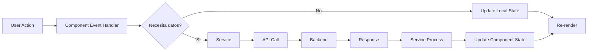

# Uso de Objetos y Estructuración del Frontend en Blood4Life

## Introducción

El frontend de Blood4Life está construido con **React 18** y **TypeScript**, siguiendo principios de arquitectura limpia y patrones modernos de desarrollo. La aplicación está organizada de forma modular, escalable y mantenible, facilitando el trabajo en equipo y la adición de nuevas funcionalidades.

## Tecnologías y Herramientas

- **React 18** - Biblioteca UI con hooks y componentes funcionales
- **TypeScript** - Tipado estático para mayor seguridad y mantenibilidad
- **Vite** - Build tool y dev server ultra-rápido
- **React Router** - Navegación y enrutamiento
- **Axios** - Cliente HTTP para comunicación con el backend
- **TailwindCSS** - Framework CSS utility-first
- **Context API** - Gestión de estado global

## Estructura de Carpetas

```
frontend/src/
├── App.tsx                 # Componente raíz de la aplicación
├── main.tsx                # Punto de entrada de la aplicación
├── index.css               # Estilos globales
├── config.ts               # Configuración global (API_URL, etc.)
│
├── assets/                 # Recursos estáticos
│   └── images/             # Imágenes del proyecto
│
├── components/             # Componentes reutilizables
│   ├── BloodDonorForm/
│   ├── FormField/
│   ├── SelectField/
│   ├── ImageUpload/
│   ├── LoginForm/
│   ├── ProtectedRoute/
│   └── UI/                 # Componentes de interfaz
│       ├── Button/
│       ├── Header/
│       └── Footer/
│
├── context/                # Contextos de React (estado global)
│   └── AuthContext.tsx
│
├── hooks/                  # Custom hooks reutilizables
│   ├── useDocumentTitle.ts
│   └── useHospitalCrud.ts
│
├── models/                 # Interfaces y tipos TypeScript
│   ├── BloodDonor.ts
│   └── Hospital.ts
│
├── pages/                  # Páginas/vistas de la aplicación
│   ├── Index.tsx
│   ├── Login/
│   ├── Register/
│   ├── BloodDonorRegisterPage/
│   ├── HospitalRegisterPage/
│   ├── DashboardBloodDonorPage/
│   ├── DashboardHospitalPage/
│   ├── BloodDonorFullCrudPage/
│   ├── HospitalFullCrudPage/
│   └── UnifiedDashboard/
│
├── services/               # Servicios de comunicación con API
│   ├── authService.ts
│   ├── bloodDonorService.ts
│   ├── hospitalService.ts
│   └── dashboardService.ts
│
├── utils/                  # Utilidades y helpers
│   └── axiosInstance.ts
│
└── tests/                  # Tests unitarios e integración
```

## Organización por Responsabilidades

### 1. Modelos (models/)

Los **modelos** definen las interfaces TypeScript que representan las entidades del dominio.

#### BloodDonor.ts

```typescript
// models/BloodDonor.ts
export interface BloodDonor {
  id?: number;        // Opcional: no existe al crear
  dni: string;
  firstName: string;
  lastName: string;
  gender: string;
  email: string;
  phoneNumber: string;
  dateOfBirth: string;
  password?: string;  // Opcional: no se devuelve en listados
}
```

**Características:**
- **Propiedades opcionales** (`?`) para campos que no siempre están presentes
- **Tipado fuerte** para evitar errores en tiempo de compilación
- **Documentación implícita** de la estructura de datos

#### Hospital.ts

```typescript
// models/Hospital.ts
export interface Hospital {
  id?: number;
  cif: string;
  name: string;
  address: string;
  email: string;
  phoneNumber: string;
  password: string;
}

// Utility type: Hospital sin el campo 'id'
export type HospitalFormData = Omit<Hospital, 'id'>;
```

**Utility Types:**
- `Omit<Hospital, 'id'>` - Crea un tipo derivado sin el campo `id`
- Útil para formularios donde el `id` se genera en el backend
- Evita repetir interfaces similares

### 2. Servicios (services/)

Los **servicios** encapsulan la lógica de comunicación con el backend.

#### hospitalService.ts

```typescript
// services/hospitalService.ts
import axiosInstance from '../utils/axiosInstance';
import type { Hospital, HospitalFormData } from '../models/Hospital';

export const hospitalService = {
  // Obtener todos los hospitales
  async getHospitales(): Promise<Hospital[]> {
    try {
      const response = await axiosInstance.get('/hospital');
      const data = response.data;

      // Normalización de respuesta
      if (Array.isArray(data)) {
        return data;
      } else if (Array.isArray((data as any).data)) {
        return (data as any).data;
      } else {
        console.error('Formato inesperado de respuesta:', data);
        return [];
      }
    } catch (error) {
      console.error('Error al obtener hospitales:', error);
      return [];
    }
  },

  // Crear un hospital
  async createHospital(hospital: HospitalFormData): Promise<Hospital> {
    const response = await axiosInstance.post('/hospital', hospital);
    return response.data;
  },

  // Actualizar un hospital
  async updateHospital(hospital: Hospital): Promise<Hospital | { message: string }> {
    const response = await axiosInstance.put('/hospital', hospital);
    return response.data;
  },

  // Eliminar un hospital
  async deleteHospital(id: number): Promise<{ status: string }> {
    const response = await axiosInstance.delete(`/hospital/${id}`);
    return response.data;
  },
};
```

**Principios aplicados:**
- ✅ **Separación de responsabilidades**: La lógica HTTP está aislada
- ✅ **Reutilización**: Un servicio puede ser usado por múltiples componentes
- ✅ **Manejo de errores**: Try-catch con fallbacks
- ✅ **Tipado fuerte**: Todos los métodos tienen tipos de retorno explícitos
- ✅ **Promesas async/await**: Código más legible

#### bloodDonorService.ts

```typescript
// services/bloodDonorService.ts
import axiosInstance from '../utils/axiosInstance';
import type { BloodDonor } from '../models/BloodDonor';

export const bloodDonorService = {
  getAll: () => {
    return axiosInstance.get<BloodDonor[]>('/bloodDonor');
  },
  
  delete: (id: number) => {
    return axiosInstance.delete<{ status: string }>(`/bloodDonor/${id}`);
  },
  
  create: (bloodDonor: BloodDonor) => {
    return axiosInstance.post<BloodDonor>('/bloodDonor', bloodDonor);
  },
  
  update: (id: number, data: BloodDonor) => {
    return axiosInstance.put(`/bloodDonor/${id}`, data);
  }
};
```

**Patrón de diseño:**
- **Object literal** con métodos
- **Exportación directa** del objeto
- Cada método retorna una promesa de Axios

### 3. Custom Hooks (hooks/)

Los **custom hooks** encapsulan lógica reutilizable con estado.

#### useHospitalCrud.ts

```typescript
// hooks/useHospitalCrud.ts
import { useState, useEffect } from 'react';
import type { Hospital, HospitalFormData } from '../models/Hospital';
import { hospitalService } from '../services/hospitalService';

export const useHospitalCrud = () => {
  // Estado
  const [hospitales, setHospitales] = useState<Hospital[]>([]);
  const [editingHospital, setEditingHospital] = useState<Hospital | null>(null);
  const [loading, setLoading] = useState<boolean>(false);
  const [error, setError] = useState<string>('');
  const [success, setSuccess] = useState<string>('');
  const [showPassword, setShowPassword] = useState<boolean>(false);
  const [formData, setFormData] = useState<HospitalFormData>({
    cif: '',
    name: '',
    address: '',
    email: '',
    phoneNumber: '',
    password: ''
  });

  // Validaciones
  const validateCreate = (): boolean => {
    if (!formData.cif || !formData.name || !formData.address || !formData.password) {
      setError('CIF, nombre, dirección y contraseña son obligatorios');
      return false;
    }
    return true;
  };

  const validateUpdate = (): boolean => {
    if (!editingHospital?.id) {
      setError('No hay un hospital seleccionado para editar');
      return false;
    }
    return validateCreate();
  };

  // Operaciones CRUD
  const loadHospitales = async () => {
    setLoading(true);
    setError('');
    try {
      const data = await hospitalService.getHospitales();
      setHospitales(data);
    } catch (err) {
      setError('Error al cargar los hospitales');
      console.error(err);
    } finally {
      setLoading(false);
    }
  };

  const handleCreate = async (e: React.FormEvent) => {
    e.preventDefault();
    setError('');
    setSuccess('');

    if (!validateCreate()) return;

    setLoading(true);
    try {
      const newHospital = await hospitalService.createHospital(formData);
      setHospitales(prev => [...prev, newHospital]);
      setSuccess('Hospital creado exitosamente');
      resetForm();
    } catch (err) {
      setError('Error al crear el hospital');
      console.error(err);
    } finally {
      setLoading(false);
    }
  };

  const handleUpdate = async (e: React.FormEvent) => {
    e.preventDefault();
    setError('');
    setSuccess('');

    if (!validateUpdate()) return;

    setLoading(true);
    try {
      const hospitalToUpdate: Hospital = {
        id: editingHospital!.id,
        ...formData
      };

      const result = await hospitalService.updateHospital(hospitalToUpdate);

      if ('message' in result) {
        setError(result.message);
      } else {
        setHospitales(prev =>
          prev.map(hosp => hosp.id === result.id ? result : hosp)
        );
        setSuccess('Hospital actualizado exitosamente');
        resetForm();
      }
    } catch (err) {
      setError('Error al actualizar el hospital');
      console.error(err);
    } finally {
      setLoading(false);
    }
  };

  const handleEdit = (hospital: Hospital) => {
    setEditingHospital(hospital);
    setFormData({
      cif: hospital.cif,
      name: hospital.name,
      address: hospital.address,
      email: hospital.email,
      phoneNumber: hospital.phoneNumber,
      password: hospital.password
    });
    setError('');
    setSuccess('');
  };

  const handleDelete = async (id: number | undefined) => {
    if (id === undefined) {
      setError('ID del hospital no válido');
      return;
    }

    if (!window.confirm('¿Estás seguro de eliminar este hospital?')) return;

    setLoading(true);
    setError('');
    try {
      await hospitalService.deleteHospital(id);
      setHospitales(prev => prev.filter(hosp => hosp.id !== id));
      setSuccess('Hospital eliminado exitosamente');
    } catch (err) {
      setError('Error al eliminar el hospital');
      console.error(err);
    } finally {
      setLoading(false);
    }
  };

  const resetForm = () => {
    setFormData({
      cif: '',
      name: '',
      address: '',
      email: '',
      phoneNumber: '',
      password: ''
    });
    setEditingHospital(null);
    setShowPassword(false);
    setError('');
  };

  const handleInputChange = (e: React.ChangeEvent<HTMLInputElement>) => {
    const { name, value } = e.target;
    setFormData(prev => ({
      ...prev,
      [name]: value
    }));
  };

  // Cargar hospitales al montar el componente
  useEffect(() => {
    loadHospitales();
  }, []);

  // Retornar estado y métodos
  return {
    // Estado
    hospitales,
    editingHospital,
    loading,
    error,
    success,
    showPassword,
    formData,

    // Setters
    setShowPassword,

    // Métodos
    loadHospitales,
    handleInputChange,
    handleCreate,
    handleUpdate,
    handleEdit,
    handleDelete,
    resetForm
  };
};
```

**Ventajas de custom hooks:**

- ✅ **Reutilización de lógica**: Puede usarse en múltiples componentes
- ✅ **Código declarativo**: El componente que lo usa no necesita saber los detalles
- ✅ **Testeable**: Se puede probar de forma aislada
- ✅ **Separación de preocupaciones**: Lógica de negocio fuera del componente UI

**Uso en un componente:**

```typescript
// En HospitalCrudPage.tsx
function HospitalCrudPage() {
  const {
    hospitales,
    editingHospital,
    loading,
    error,
    success,
    formData,
    handleInputChange,
    handleCreate,
    handleUpdate,
    handleEdit,
    handleDelete,
    resetForm
  } = useHospitalCrud();

  return (
    <div>
      {/* UI que usa el estado y métodos del hook */}
      {loading && <p>Cargando...</p>}
      {error && <div className="error">{error}</div>}
      {/* ... resto de la UI */}
    </div>
  );
}
```

### 4. Componentes Reutilizables (components/)

#### FormField Component

```typescript
// components/FormField/FormField.tsx
import React from 'react';

interface FormFieldProps {
  type?: 'text' | 'email' | 'password' | 'tel' | 'number' | 'date';
  id: string;
  name: string;
  label: string;
  value: string;
  onChange: (e: React.ChangeEvent<HTMLInputElement>) => void;
  required?: boolean;
  disabled?: boolean;
  error?: string;
  placeholder?: string;
  containerClass?: string;
  labelClass?: string;
  showPasswordToggle?: boolean;
  isPasswordVisible?: boolean;
  onTogglePassword?: () => void;
  autoComplete?: string;
}

const FormField: React.FC<FormFieldProps> = ({
  type = 'text',
  id,
  name,
  label,
  value,
  onChange,
  required = false,
  disabled = false,
  error,
  placeholder,
  containerClass = '',
  showPasswordToggle = false,
  isPasswordVisible = false,
  onTogglePassword,
  autoComplete,
}) => {
  const inputType = showPasswordToggle ? (isPasswordVisible ? 'text' : 'password') : type;

  return (
    <div className={`w-full ${containerClass}`}>
      <label htmlFor={id} className="block font-poppins font-medium text-body-sm md:text-body text-black mb-1">
        {label}
      </label>

      <div className="relative">
        <input
          type={inputType}
          id={id}
          name={name}
          value={value}
          onChange={onChange}
          required={required}
          disabled={disabled}
          className={`w-full font-roboto text-body-sm md:text-body px-3 py-2 md:px-4 md:py-2.5 border rounded-md shadow-sm focus:outline-none focus:ring-2 focus:ring-blue-500 focus:border-blue-500 disabled:bg-gray-100 bg-white ${
            error ? 'border-red-500' : 'border-gray-300'
          } ${showPasswordToggle ? 'pr-10' : ''}`}
          placeholder={placeholder}
          autoComplete={autoComplete}
        />

        {showPasswordToggle && (
          <div className="absolute inset-y-0 right-0 flex items-center pr-3">
            <button
              type="button"
              onClick={onTogglePassword}
              className="text-gray-400 hover:text-gray-600 focus:outline-none"
            >
              {/* Iconos SVG de ojo */}
            </button>
          </div>
        )}
      </div>

      {error && <p className="font-roboto text-red-500 text-caption mt-1">{error}</p>}
    </div>
  );
};

export default FormField;
```

**Características:**
- **Props bien tipadas** con interface
- **Valores por defecto** para props opcionales
- **Composición**: Combina label, input y mensaje de error
- **Reutilizable**: Se usa en todos los formularios
- **Accesible**: Labels asociados con `htmlFor`

#### Button Component

```typescript
// components/UI/Button/Button.tsx
import { useNavigate } from "react-router";

interface Props {
  children: React.ReactNode;
  variant?: "blue" | "red" | "green" | "gray";
  onButtonClick?: () => void;
  textColor?: "black" | "white";
  type?: "button" | "submit" | "reset";
  to?: string;
  disabled?: boolean;
  className?: string;
  onClick?: () => void;
}

const Button: React.FC<Props> = ({
  children,
  variant = "blue",
  onButtonClick,
  textColor = "white",
  type = "button",
  to,
  disabled = false,
  className = "",
  onClick,
}) => {
  const navigate = useNavigate();

  const handleClick = () => {
    if (disabled) return;
    if (onButtonClick) onButtonClick();
    if (onClick) onClick();
    if (to) navigate(to);
  };

  // Variantes de color con TailwindCSS
  const colorVariants: Record<string, string> = {
    blue: "bg-blue-600 hover:bg-blue-700",
    red: "bg-red-600 hover:bg-red-700",
    green: "bg-green-600 hover:bg-green-700",
    gray: "bg-gray-500 hover:bg-gray-600",
  };

  const textColorClasses = {
    black: "text-black",
    white: "text-white",
  };

  const disabledStyles = disabled
    ? "opacity-50 cursor-not-allowed"
    : "";

  const baseStyles = `
    inline-flex items-center justify-center
    px-3 py-2 sm:px-4 sm:py-2.5 md:px-5 md:py-3
    rounded-md shadow-sm
    text-body-sm md:text-body font-poppins font-medium
    transition-all duration-150 transform active:scale-95
  `;

  return (
    <button
      type={type}
      onClick={handleClick}
      disabled={disabled}
      className={`
        ${baseStyles}
        ${colorVariants[variant]}
        ${textColorClasses[textColor]}
        ${disabledStyles}
        ${className}
      `}
    >
      {children}
    </button>
  );
};

export default Button;
```

**Características:**
- **Navegación integrada**: Propiedad `to` para redirección
- **Variantes de estilo**: `blue`, `red`, `green`, `gray`
- **Estados**: Normal, hover, active, disabled
- **Responsive**: Tamaños adaptativos con breakpoints
- **Composición**: Acepta cualquier contenido como children

### 5. Context API (context/)

#### AuthContext.tsx

```typescript
// context/AuthContext.tsx
import React, { createContext, useState, useContext, useEffect, type ReactNode } from 'react';
import axiosInstance from '../utils/axiosInstance';

interface AuthContextType {
  userType: 'bloodDonor' | 'hospital' | 'admin' | null;
  login: (type: 'bloodDonor' | 'hospital' | 'admin') => void;
  logout: () => void;
  isAuthenticated: boolean;
  isLoading: boolean;
}

const AuthContext = createContext<AuthContextType | undefined>(undefined);

export const AuthProvider: React.FC<{ children: ReactNode }> = ({ children }) => {
  const [userType, setUserType] = useState<'bloodDonor' | 'hospital' | 'admin' | null>(null);
  const [isAuthenticated, setIsAuthenticated] = useState(false);
  const [isLoading, setIsLoading] = useState(true);

  useEffect(() => {
    const checkAuth = async () => {
      try {
        await axiosInstance.get('/bloodDonor/me');
        setUserType('bloodDonor');
        setIsAuthenticated(true);
      } catch (e) {
        setIsAuthenticated(false);
        setUserType(null);
      } finally {
        setIsLoading(false);
      }
    };
    checkAuth();
  }, []);

  const login = (type: 'bloodDonor' | 'hospital' | 'admin') => {
    setUserType(type);
    setIsAuthenticated(true);
  };

  const logout = () => {
    setUserType(null);
    setIsAuthenticated(false);
    window.location.href = '/login';
  };

  return (
    <AuthContext.Provider value={{ userType, login, logout, isAuthenticated, isLoading }}>
      {children}
    </AuthContext.Provider>
  );
};

// Custom hook para usar el contexto
export const useAuth = () => {
  const context = useContext(AuthContext);
  if (context === undefined) {
    throw new Error('useAuth must be used within an AuthProvider');
  }
  return context;
};
```

**Patrón Provider-Consumer:**
1. **Crear contexto** con `createContext`
2. **Proveer valor** con `<AuthProvider>`
3. **Consumir** con custom hook `useAuth()`

### 6. Utilidades (utils/)

#### axiosInstance.ts

```typescript
// utils/axiosInstance.ts
import axios from 'axios';
import { API_URL } from '../config';

const axiosInstance = axios.create({
  baseURL: API_URL,
  withCredentials: true, // Enviar cookies automáticamente
});

export default axiosInstance;
```

**Configuración centralizada:**
- ✅ **Base URL** configurable desde `.env`
- ✅ **withCredentials**: Envía cookies JWT
- ✅ **Reutilizable**: Un solo punto de configuración

### 7. Configuración (config.ts)

```typescript
// config.ts
export const API_URL = import.meta.env.VITE_API_URL || '/api';
```

**Variables de entorno:**
- `VITE_API_URL` se define en `.env`
- Valor por defecto: `'/api'`
- Accesible desde toda la aplicación

## Patrones de Diseño Implementados

### 1. Container/Presentational Components

**Container (Smart Component):**
```typescript
// BloodDonorCrudPage.tsx
function BloodDonorCrudPage() {
  const [donors, setDonors] = useState<BloodDonor[]>([]);
  // ... lógica de estado y operaciones

  return <BloodDonorTable donors={donors} onDelete={handleDelete} />;
}
```

**Presentational (Dumb Component):**
```typescript
// BloodDonorTable.tsx
interface Props {
  donors: BloodDonor[];
  onDelete: (id: number) => void;
}

function BloodDonorTable({ donors, onDelete }: Props) {
  return (
    <table>
      {donors.map(donor => (
        <tr key={donor.id}>
          <td>{donor.name}</td>
          <button onClick={() => onDelete(donor.id)}>Eliminar</button>
        </tr>
      ))}
    </table>
  );
}
```

### 2. Custom Hooks Pattern

Extraer lógica reutilizable en hooks personalizados:

```typescript
// useDocumentTitle.ts
import { useEffect } from 'react';

export const useDocumentTitle = (title: string) => {
  useEffect(() => {
    document.title = `${title} | Blood4Life`;
    return () => {
      document.title = 'Blood4Life';
    };
  }, [title]);
};

// Uso
function DashboardPage() {
  useDocumentTitle('Dashboard');
  // ...
}
```

### 3. Service Layer Pattern

Separar la lógica de comunicación HTTP en servicios dedicados:

```typescript
// service
export const userService = {
  getAll: () => api.get('/users'),
  getById: (id) => api.get(`/users/${id}`),
  create: (data) => api.post('/users', data),
  // ...
};

// component
const users = await userService.getAll();
```

### 4. Composition Pattern

Componer componentes complejos a partir de componentes simples:

```typescript
<FormField
  type="email"
  label="Email"
  value={formData.email}
  onChange={handleChange}
  error={errors.email}
/>

// En lugar de un componente monolítico EmailField
```

## Convenciones de Código

### 1. Nomenclatura

| Tipo | Convención | Ejemplo |
|------|------------|---------|
| **Componentes** | PascalCase | `LoginForm`, `BloodDonorTable` |
| **Hooks** | camelCase con prefijo `use` | `useAuth`, `useHospitalCrud` |
| **Interfaces** | PascalCase | `BloodDonor`, `Hospital` |
| **Funciones** | camelCase | `handleSubmit`, `validateForm` |
| **Variables** | camelCase | `formData`, `isLoading` |
| **Constantes** | UPPER_SNAKE_CASE | `API_URL`, `MAX_RETRIES` |
| **Archivos de componentes** | PascalCase.tsx | `Button.tsx`, `Header.tsx` |
| **Archivos de hooks** | camelCase.ts | `useAuth.ts` |
| **Archivos de servicios** | camelCase.ts | `authService.ts` |

### 2. Estructura de Componentes

```typescript
// 1. Imports
import React, { useState, useEffect } from 'react';
import { useNavigate } from 'react-router';
import Button from '../UI/Button/Button';

// 2. Interfaces/Types
interface Props {
  title: string;
  onClose: () => void;
}

// 3. Componente
const MyComponent: React.FC<Props> = ({ title, onClose }) => {
  // 3.1 Hooks
  const navigate = useNavigate();
  const [isOpen, setIsOpen] = useState(false);

  // 3.2 Efectos
  useEffect(() => {
    // ...
  }, []);

  // 3.3 Handlers
  const handleClick = () => {
    // ...
  };

  // 3.4 Render
  return (
    <div>
      <h1>{title}</h1>
      <Button onClick={handleClick}>Close</Button>
    </div>
  );
};

// 4. Export
export default MyComponent;
```

### 3. TypeScript Best Practices

```typescript
// ✅ Interfaces para props
interface ButtonProps {
  children: React.ReactNode;
  onClick: () => void;
}

// ✅ Tipos explícitos
const users: User[] = [];
const count: number = 0;

// ✅ Utility types
type UserFormData = Omit<User, 'id'>;
type PartialUser = Partial<User>;

// ✅ Genéricos
function getData<T>(url: string): Promise<T> {
  return axiosInstance.get(url);
}

// ✅ Type guards
function isError(response: any): response is { error: string } {
  return 'error' in response;
}
```

## Flujo de Datos



**Ejemplo concreto:**

1. **Usuario** click en "Crear Hospital"
2. **Component** `handleCreate()`
3. **Validation** en el componente
4. **Service** `hospitalService.create Hospital()`
5. **Axios** POST `/api/hospital`
6. **Backend** procesa y responde
7. **Service** retorna `Hospital` creado
8. **Component** actualiza `hospitales` state
9. **React** re-renderiza la tabla

## Mejores Prácticas Implementadas

### 1. Separación de Responsabilidades

- ✅ **Componentes**: Solo UI y lógica de presentación
- ✅ **Hooks**: Lógica de negocio reutilizable
- ✅ **Servicios**: Comunicación con API
- ✅ **Modelos**: Definición de tipos
- ✅ **Utils**: Funciones auxiliares

### 2. DRY (Don't Repeat Yourself)

```typescript
// ❌ Repetición
<input className="w-full px-4 py-2 border rounded..." />
<input className="w-full px-4 py-2 border rounded..." />

// ✅ Componente reutilizable
<FormField {...props} />
<FormField {...props} />
```

### 3. Props Drilling Evitado

```typescript
// ❌ Props drilling (pasar props por múltiples niveles)
<GrandParent user={user}>
  <Parent user={user}>
    <Child user={user} />
  </Parent>
</GrandParent>

// ✅ Context API
<AuthProvider>
  <GrandParent>
    <Parent>
      <Child /> {/* usa useAuth() directamente */}
    </Parent>
  </GrandParent>
</AuthProvider>
```

### 4. Estado Local vs Global

**Estado local** (useState):
- Formularios
- Modales abiertos/cerrados
- Tabs activos

**Estado global** (Context):
- Autenticación
- Tema (dark/light mode)
- Idioma

### 5. Manejo de Errores

```typescript
try {
  const data = await service.getData();
  // manejo de éxito
} catch (error) {
  console.error('Error:', error);
  setError(error.message || 'Error desconocido');
}
```

### 6. Loading States

```typescript
const [loading, setLoading] = useState(false);

const fetchData = async () => {
  setLoading(true);
  try {
    const data = await service.getData();
    setData(data);
  } finally {
    setLoading(false); // Siempre se ejecuta
  }
};

return loading ? <Spinner /> : <DataList data={data} />;
```

## Conclusión

El frontend de Blood4Life está estructurado siguiendo principios de **arquitectura limpia** y **mejores prácticas de React + TypeScript**:

✅ **Separación de responsabilidades** clara (componentes, servicios, hooks, modelos)  
✅ **Reutilización de código** con componentes y hooks personalizados  
✅ **Tipado fuerte** con TypeScript para prevenir errores  
✅ **Patrones modernos** (Container/Presentational, Service Layer, Custom Hooks)  
✅ **Convenciones consistentes** en nomenclatura y estructura  
✅ **Código mantenible** y escalable para futuros desarrollos  
✅ **DRY principle** aplicado en componentes y lógica  
✅ **Context API** para estado global sin props drilling  
✅ **Manejo robusto** de errores y estados de carga

Esta arquitectura permite que el proyecto crezca de forma ordenada, facilitando el trabajo en equipo y la incorporación de nuevas funcionalidades sin comprometer la calidad del código.
