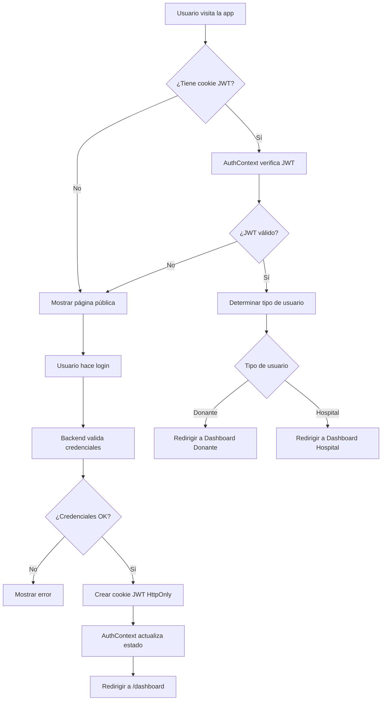
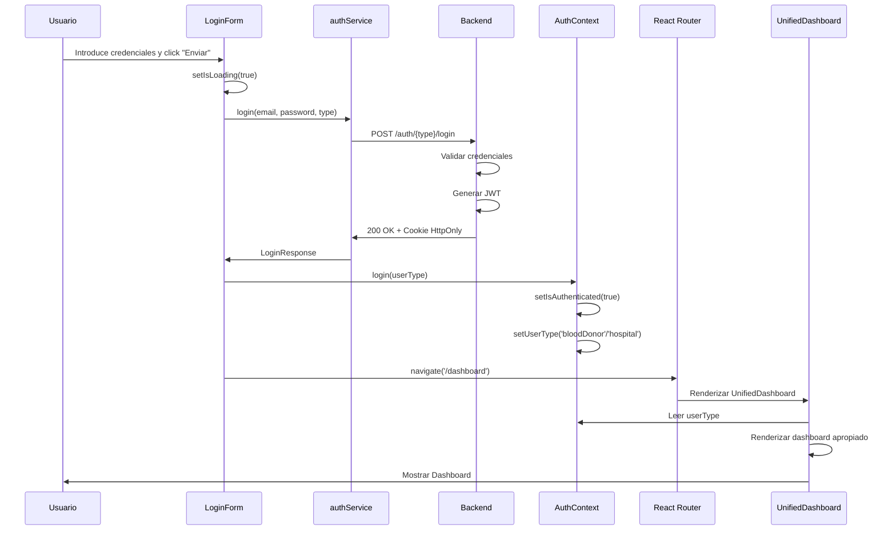

# Gestión del Login y Logout del Cliente en Blood4Life

## Introducción

La gestión de login y logout en Blood4Life está diseñada para proporcionar una experiencia de usuario fluida y segura. El sistema maneja la autenticación de dos tipos de usuarios (Donantes y Hospitales) con un flujo unificado pero diferenciado según el rol.

## Arquitectura de Gestión de Sesión



## Componentes Clave del Sistema

### 1. AuthContext - Gestión de Estado Global

El `AuthContext` es el corazón de la gestión de sesión en el frontend. Proporciona el estado de autenticación a toda la aplicación.

```typescript
// AuthContext.tsx
import React, { createContext, useState, useContext, useEffect, type ReactNode } from 'react';
import axiosInstance from '../utils/axiosInstance';

interface AuthContextType {
  userType: 'bloodDonor' | 'hospital' | 'admin' | null;
  login: (type: 'bloodDonor' | 'hospital' | 'admin') => void;
  logout: () => void;
  isAuthenticated: boolean;
  isLoading: boolean;
}

const AuthContext = createContext<AuthContextType | undefined>(undefined);

export const AuthProvider: React.FC<{ children: ReactNode }> = ({ children }) => {
  const [userType, setUserType] = useState<'bloodDonor' | 'hospital' | 'admin' | null>(null);
  const [isAuthenticated, setIsAuthenticated] = useState(false);
  const [isLoading, setIsLoading] = useState(true);

  // Verificar autenticación al cargar la aplicación
  useEffect(() => {
    const checkAuth = async () => {
      try {
        // Intentar obtener perfil del donante
        await axiosInstance.get('/bloodDonor/me');
        setUserType('bloodDonor');
        setIsAuthenticated(true);
      } catch (e) {
        // Si falla, el usuario no está autenticado
        setIsAuthenticated(false);
        setUserType(null);
      } finally {
        setIsLoading(false);
      }
    };
    checkAuth();
  }, []);

  const login = (type: 'bloodDonor' | 'hospital' | 'admin') => {
    setUserType(type);
    setIsAuthenticated(true);
  };

  const logout = () => {
    setUserType(null);
    setIsAuthenticated(false);
    // Forzar recarga para limpiar estado
    window.location.href = '/login';
  };

  return (
    <AuthContext.Provider value={{ userType, login, logout, isAuthenticated, isLoading }}>
      {children}
    </AuthContext.Provider>
  );
};

export const useAuth = () => {
  const context = useContext(AuthContext);
  if (context === undefined) {
    throw new Error('useAuth must be used within an AuthProvider');
  }
  return context;
};
```

**Responsabilidades del AuthContext:**

1. **Mantener el estado de autenticación** (`isAuthenticated`, `userType`)
2. **Verificar sesión al cargar** la aplicación
3. **Proporcionar funciones** `login()` y `logout()`
4. **Compartir estado** con toda la aplicación mediante Context API

### 2. LoginForm - Interfaz de Inicio de Sesión

El componente `LoginForm` gestiona la interfaz de usuario para el login.

```typescript
// LoginForm.tsx
import { Link, useNavigate } from 'react-router';
import Button from '../../components/UI/Button/Button';
import FormField from '../../components/FormField/FormField';
import { useState, useCallback } from 'react';
import { authService } from '../../services/authService';
import { useAuth } from '../../context/AuthContext';

function LoginForm() {
  const navigate = useNavigate();
  const { login } = useAuth();

  const [formData, setFormData] = useState({
    username: '',
    password: ''
  });

  const [userType, setUserType] = useState<'bloodDonor' | 'hospital' | 'admin'>('bloodDonor');
  const [showPassword, setShowPassword] = useState(false);
  const [error, setError] = useState<string | null>(null);
  const [isLoading, setIsLoading] = useState(false);

  const handleInputChange = useCallback((e: React.ChangeEvent<HTMLInputElement>) => {
    const { name, value } = e.target;
    setFormData(prev => ({
      ...prev,
      [name]: value
    }));
  }, []);

  const handleSubmit = async (e: React.FormEvent) => {
    e.preventDefault();
    setError(null);
    setIsLoading(true);

    try {
      // Llamar al servicio de autenticación
      await authService.login(formData.username, formData.password, userType);
      
      // Actualizar contexto de autenticación
      login(userType);

      // Redirigir al dashboard
      navigate('/dashboard');

    } catch (err: any) {
      console.error(err);
      setError(err.response?.data?.error || 'Error al iniciar sesión. Verifique sus credenciales.');
    } finally {
      setIsLoading(false);
    }
  };

  return (
    <div className="flex justify-center items-center w-full px-4 sm:px-6 md:px-0">
      <form
        className="flex flex-col w-full max-w-md bg-white rounded-2xl shadow-xl p-6 sm:p-8 gap-4 sm:gap-6"
        onSubmit={handleSubmit}
        aria-busy={isLoading}
      >
        <h2 className="font-poppins font-bold text-h3 sm:text-h2 text-gray-800 text-center mb-4">
          Iniciar sesión
        </h2>

        {/* Mensaje de error */}
        {error && (
          <div
            className="bg-red-100 border border-red-400 text-red-700 px-4 py-3 rounded"
            role="alert"
            aria-live="assertive"
          >
            <span>{error}</span>
          </div>
        )}

        {/* Selector de tipo de usuario */}
        <div className="flex justify-center gap-4 mb-2">
          <label className="inline-flex items-center cursor-pointer">
            <input
              type="radio"
              className="form-radio text-blue-600"
              name="userType"
              value="bloodDonor"
              checked={userType === 'bloodDonor'}
              onChange={() => setUserType('bloodDonor')}
            />
            <span className="ml-2 text-gray-700">Donante</span>
          </label>

          <label className="inline-flex items-center cursor-pointer">
            <input
              type="radio"
              className="form-radio text-blue-600"
              name="userType"
              value="hospital"
              checked={userType === 'hospital'}
              onChange={() => setUserType('hospital')}
            />
            <span className="ml-2 text-gray-700">Hospital</span>
          </label>
        </div>

        {/* Campo de email */}
        <FormField
          type="email"
          id="username"
          name="username"
          label="Correo electrónico"
          value={formData.username}
          onChange={handleInputChange}
          required
          placeholder="Ingrese su correo"
          containerClass="mb-2"
          labelClass="text-sm sm:text-base"
          autoComplete="email"
          aria-invalid={!!error}
        />

        {/* Campo de contraseña */}
        <FormField
          type="password"
          id="password"
          name="password"
          label="Contraseña"
          value={formData.password}
          onChange={handleInputChange}
          required
          placeholder="Ingrese su contraseña"
          containerClass="mb-4"
          labelClass="text-sm sm:text-base"
          showPasswordToggle={true}
          isPasswordVisible={showPassword}
          onTogglePassword={() => setShowPassword(!showPassword)}
          autoComplete="current-password"
        />

        {/* Botón de envío */}
        <div className="flex justify-center">
          <Button
            type="submit"
            className="px-6 sm:px-8 py-2 sm:py-3 text-body w-full sm:w-auto sm:max-w-64 disabled:opacity-50"
            disabled={isLoading}
          >
            {isLoading ? 'Cargando...' : 'Enviar'}
          </Button>
        </div>

        {/* Link de registro */}
        <div className="text-center mt-2">
          <span className="text-sm sm:text-base text-gray-600">
            ¿No tiene una cuenta? Regístrate haciendo click{' '}
            <Link
              to="/register"
              className="text-blue-600 hover:text-blue-800 underline"
            >
              aquí
            </Link>
          </span>
        </div>
      </form>
    </div>
  );
}

export default LoginForm;
```

**Características del LoginForm:**

- ✅ **Selector de tipo de usuario** (radio buttons)
- ✅ **Validación de campos** (email, contraseña requeridos)
- ✅ **Mostrar/ocultar contraseña**
- ✅ **Manejo de errores** con feedback visual
- ✅ **Estado de carga** (botón deshabilitado durante el proceso)
- ✅ **Integración con AuthContext** para actualizar estado global

### 3. authService - Comunicación con el Backend

El servicio de autenticación encapsula las llamadas HTTP al backend:

```typescript
// authService.ts
import axios from 'axios';
import { API_URL } from '../config';

export interface LoginResponse {
  status: string;
  message: string;
}

export const authService = {
  login: async (email: string, password: string, type: 'bloodDonor' | 'hospital' | 'admin') => {
    // Codificar credenciales en Base64
    const credentials = btoa(`${email}:${password}`);
    
    const response = await axios.post<LoginResponse>(
      `${API_URL}/auth/${type}/login`,
      {},
      {
        headers: {
          Authorization: `Basic ${credentials}`,
        },
        withCredentials: true // CRUCIAL: Permite recibir y enviar cookies
      }
    );
    
    return response.data;
  },
  
  registerHospital: async (hospitalData: FormData) => {
    const response = await axios.post(`${API_URL}/auth/hospital/register`, hospitalData);
    return response.data;
  },

  registerBloodDonor: (submitData: FormData) => {
    return axiosInstance.post(
      `/auth/bloodDonor/register`,
      submitData,
      { withCredentials: false }
    );
  }
};
```

**Detalles importantes:**

- **Basic Authentication:** Las credenciales se envían codificadas en Base64 en el header `Authorization`
- **withCredentials: true:** Permite que el navegador almacene y envíe cookies HttpOnly
- **Tipo dinámico:** El endpoint cambia según el tipo de usuario (`/bloodDonor/login` o `/hospital/login`)

### 4. ProtectedRoute - Protección de Rutas

El componente `ProtectedRoute` protege rutas que requieren autenticación:

```typescript
// ProtectedRoute.tsx
import { Navigate, Outlet } from 'react-router-dom';
import { useAuth } from '../../context/AuthContext';

const ProtectedRoute = () => {
  const { isAuthenticated } = useAuth();

  if (!isAuthenticated) {
    // Redirigir a login si no está autenticado
    return <Navigate to="/login" replace />;
  }

  // Renderizar las rutas hijas
  return <Outlet />;
};

export default ProtectedRoute;
```

**Uso en App.tsx:**

```typescript
// App.tsx
<Routes>
  {/* Rutas públicas */}
  <Route path="/login" element={<Login />} />
  <Route path="/register" element={<Register />} />
  
  {/* Rutas protegidas */}
  <Route element={<ProtectedRoute />}>
    <Route path="/bloodDonors" element={<BloodDonorCrudPage />} />
    <Route path="/hospitals" element={<HospitalCrudPage />} />
  </Route>
</Routes>
```

### 5. UnifiedDashboard - Redirección por Tipo de Usuario

El `UnifiedDashboard` redirige al dashboard apropiado según el tipo de usuario:

```typescript
// UnifiedDashboard.tsx
import { useAuth } from '../../context/AuthContext';
import DashboardPage from '../DashboardBloodDonorPage/DashboardBloodDonorPage';
import DashboardHospitalPage from '../DashboardHospitalPage/DashboardHospitalPage';

const UnifiedDashboard = () => {
    const { userType, isLoading } = useAuth();

    // Mostrar loading mientras se verifica la autenticación
    if (isLoading) {
        return (
            <div className="flex items-center justify-center min-h-screen bg-gray-100 p-0">
                <div className="text-xl font-semibold text-gray-600">Cargando...</div>
            </div>
        );
    }

    // Renderizar dashboard según tipo de usuario
    if (userType === 'hospital') {
        return <DashboardHospitalPage />;
    } else if (userType === 'bloodDonor') {
        return <DashboardPage />;
    }

    // Si no hay tipo de usuario, redirigir a login
    window.location.href = '/login';
    return null;
};

export default UnifiedDashboard;
```

## Flujo Completo de Login

### Paso 1: Usuario Accede a /login

1. El usuario navega a `http://localhost:5173/login`
2. Se renderiza el componente `LoginForm`
3. El formulario muestra:
   - Selector de tipo de usuario (Donante/Hospital)
   - Campo de email
   - Campo de contraseña
   - Botón "Enviar"

### Paso 2: Usuario Completa el Formulario

1. Selecciona el tipo de usuario (por defecto: "Donante")
2. Introduce su email
3. Introduce su contraseña
4. Opcionalmente, muestra/oculta la contraseña con el icono de ojo

### Paso 3: Usuario Envía el Formulario

1. Click en "Enviar"
2. Se ejecuta `handleSubmit`:
   ```typescript
   const handleSubmit = async (e: React.FormEvent) => {
     e.preventDefault();
     setError(null);
     setIsLoading(true); // Activar estado de carga

     try {
       // Llamar al backend
       await authService.login(formData.username, formData.password, userType);
       
       // Actualizar estado global
       login(userType);

       // Red irigir al dashboard
       navigate('/dashboard');
     } catch (err: any) {
       // Mostrar error
       setError(err.response?.data?.error || 'Error al iniciar sesión...');
     } finally {
       setIsLoading(false); // Desactivar estado de carga
     }
   };
   ```

### Paso 4: authService Llama al Backend

```typescript
const credentials = btoa(`${email}:${password}`); // email:password en Base64
const response = await axios.post(
  `${API_URL}/auth/${type}/login`,  // /auth/bloodDonor/login o /auth/hospital/login
  {},
  {
    headers: {
      Authorization: `Basic ${credentials}`,
    },
    withCredentials: true
  }
);
```

### Paso 5: Backend Valida y Responde

El backend (`AuthController`):

1. **Decodifica** las credenciales del header `Authorization`
2. **Busca** el usuario en la base de datos por email
3. **Verifica** la contraseña con `BCryptPasswordEncoder`
4. Si es válido:
   - Genera un **JWT** con `JwtService`
   - Crea una **cookie HttpOnly** llamada `jwt`
   - Retorna **200 OK** con `{ status: "OK", message: "Login con éxito" }`
5. Si es inválido:
   - Retorna **401 Unauthorized** con `{ error: "Error. Ingrese credenciales válidas" }`

### Paso 6: Frontend Recibe la Respuesta

**Caso de éxito:**

```typescript
// LoginForm.tsx
login(userType);  // Actualizar AuthContext
navigate('/dashboard');  // Redirigir
```

El `AuthContext` actualiza:
- `isAuthenticated = true`
- `userType = 'bloodDonor'` o `'hospital'`

**Caso de error:**

```typescript
setError(err.response?.data?.error || 'Error al iniciar sesión...');
```

Se muestra el mensaje de error en un div rojo.

### Paso 7: Redirección al Dashboard

1. React Router redirige a `/dashboard`
2. El componente `UnifiedDashboard` se renderiza
3. Lee `userType` del `AuthContext`
4. Renderiza el dashboard apropiado:
   - `DashboardPage` para donantes
   - `DashboardHospitalPage` para hospitales

### Diagrama de Secuencia Completo



## Flujo Completo de Logout

### Implementación del Logout

```typescript
// AuthContext.tsx
const logout = () => {
  // Limpiar estado de autenticación
  setUserType(null);
  setIsAuthenticated(false);
  
  // Redirigir a login y forzar recarga
  window.location.href = '/login';
};
```

**¿Por qué `window.location.href` en lugar de `navigate()`?**

- **Limpia todo el estado de la aplicación** al forzar una recarga completa
- **Elimina cualquier dato residual** en memoria
- **Asegura** que la cookie JWT sea verificada de nuevo

### Backend - Endpoint de Logout

```java
// AuthController.java
@GetMapping("/logout")
public ResponseEntity<?> logout(HttpServletResponse response) {
  // Crear cookie vacía con maxAge = 0 para eliminarla
  ResponseCookie jwtCookie = ResponseCookie.from("jwt", "")
      .httpOnly(true)
      .secure(false)
      .path("/")
      .maxAge(0)  // Eliminar cookie
      .sameSite("Lax")
      .build();

  response.setHeader(HttpHeaders.SET_COOKIE, jwtCookie.toString());
  response.setHeader(HttpHeaders.LOCATION, "http://localhost:5173/login");
  response.setStatus(HttpServletResponse.SC_FOUND); // 302 redirect

  return null;
}
```

### Ejemplo de Uso en un Componente

```typescript
// Cualquier componente
import { useAuth } from '../context/AuthContext';

function SomeComponent() {
  const { logout, userType } = useAuth();

  const handleLogout = () => {
    if (confirm('¿Estás seguro de que quieres cerrar sesión?')) {
      logout();
    }
  };

  return (
    <div>
      <p>Tipo de usuario: {userType}</p>
      <button onClick={handleLogout}>Cerrar Sesión</button>
    </div>
  );
}
```

## Verificación de Sesión al Cargar la Aplicación

Cuando el usuario recarga la página o abre la aplicación:

```typescript
// AuthContext.tsx - useEffect que se ejecuta al montar el componente
useEffect(() => {
  const checkAuth = async () => {
    try {
      // Intentar obtener perfil del usuario
      // Si la cookie JWT existe y es válida, esta petición tendrá éxito
      await axiosInstance.get('/bloodDonor/me');
      
      // Usuario autenticado como donante
      setUserType('bloodDonor');
      setIsAuthenticated(true);
    } catch (e) {
      // Cookie no existe, ha expirado, o es inválida
      setIsAuthenticated(false);
      setUserType(null);
    } finally {
      setIsLoading(false);
    }
  };
  checkAuth();
}, []);
```

**Flujo:**

1. **App se carga** → `AuthProvider` se monta
2. **useEffect se ejecuta** → Llama a `checkAuth()`
3. **Petición al backend** →`GET /bloodDonor/me` (o `/hospital/me`)
4. **Backend verifica JWT** → `JwtAuthFilter` valida la cookie
5. Si válido:
   - Frontend actualiza `isAuthenticated = true`
   - Usuario se mantiene logueado
6. Si inválido:
   - Frontend mantiene `isAuthenticated = false`
   - Usuario ve pantallas públicas

## Gestión de Rutas y Navegación

### Estructura de Rutas en App.tsx

```typescript
// App.tsx
function App() {
  return (
    <AuthProvider>
      <div className="bg-gray-100 min-h-screen flex flex-col">
        <BrowserRouter>
          <Header />

          <main className="flex-grow w-full">
            <Routes>
              {/* Rutas públicas */}
              <Route path="/index" element={<Index />} />
              <Route path="/login" element={<Login />} />
              <Route path="/register" element={<Register />} />
              <Route path="/registerbloodDonor" element={<BloodDonorRegisterPage />} />
              <Route path="/registerHospital" element={<HospitalRegisterPage />} />
              <Route path="/dashboard" element={<DashboardRedirect />} />
              <Route path="/" element={<Index />} />

              {/* Rutas protegidas */}
              <Route element={<ProtectedRoute />}>
                <Route path="/bloodDonors" element={<BloodDonorCrudPage />} />
                <Route path="/hospitals" element={<HospitalCrudPage />} />
              </Route>
            </Routes>
          </main>

          <Footer />
        </BrowserRouter>
      </div>
    </AuthProvider>
  );
}
```

### Rutas Públicas vs Protegidas

| Ruta | Tipo | Descripción |
|------|------|-------------|
| `/` | Pública | Página de inicio |
| `/login` | Pública | Formulario de login |
| `/register` | Pública | Selector de tipo de registro |
| `/registerbloodDonor` | Pública | Registro de donante |
| `/registerHospital` | Pública | Registro de hospital |
| `/dashboard` | Mixta | Redirige según autenticación |
| `/bloodDonors` | Protegida | CRUD de donantes (admin) |
| `/hospitals` | Protegida | CRUD de hospitales (admin) |

### DashboardRedirect Component

```typescript
// App.tsx
function DashboardRedirect() {
  window.location.href = 'http://localhost:8080/dashboard';
  return null;
}
```

**Nota:** Este componente redirige temporalmente al dashboard del backend. En un entorno de producción, se debería usar `UnifiedDashboard` completamente en el frontend.

## Seguridad en la Gestión de Sesión

### 1. Cookie HttpOnly

La cookie JWT es **HttpOnly**, lo que significa:

- ✅ **No accesible desde JavaScript** (`document.cookie`)
- ✅ **Protección contra XSS** (Cross-Site Scripting)
- ✅ **Enviada automáticamente** en cada petición HTTP

```java
// Backend
ResponseCookie jwtCookie = ResponseCookie.from("jwt", token)
    .httpOnly(true)  // No accesible desde JS
    .secure(false)   // true en producción (HTTPS)
    .path("/")
    .maxAge(24 * 60 * 60)
    .sameSite("Lax")
    .build();
```

### 2. withCredentials en Axios

Para que el navegador envíe cookies en peticiones cross-origin:

```typescript
// axiosInstance.ts
const axiosInstance = axios.create({
  baseURL: API_URL,
  withCredentials: true  // Enviar cookies automáticamente
});
```

### 3. Validación en Cada Petición

El `JwtAuthFilter` valida el JWT en **cada petición**:

```java
// JwtAuthFilter.java
protected void doFilterInternal(
    HttpServletRequest request,
    HttpServletResponse response,
    FilterChain chain) {
  
  String token = extractTokenFromCookie(request);
  
  if (token != null && !jwtService.isTokenExpired(token)) {
    // Token válido → establecer autenticación
    setAuthentication(token);
  }
  
  chain.doFilter(request, response);
}
```

### 4. Expiración de Tokens

Los JWT tienen un tiempo de expiración (1 hora):

```java
// JwtServiceImpl.java
private final long EXPIRATION_TIME = 1000 * 60 * 60; // 1 hora
```

Después de la expiración, el usuario debe hacer login de nuevo.

### 5. Separación de Tipos de Usuario

Los endpoints de login son **diferentes** para cada tipo:

- `/api/auth/blood Donor/login`
- `/api/auth/hospital/login`

Esto permite validaciones y lógica específica para cada rol.

## Mejores Prácticas Implementadas

### 1. Estado de Carga (Loading States)

```typescript
const [isLoading, setIsLoading] = useState(false);

// Durante el login
setIsLoading(true);
// ... llamada al backend
setIsLoading(false);

// En el componente
{isLoading ? 'Cargando...' : 'Enviar'}
<Button disabled={isLoading}>...</Button>
```

### 2. Manejo de Errores

```typescript
try {
  await authService.login(...);
} catch (err: any) {
  // Extraer mensaje del backend o usar genérico
  setError(err.response?.data?.error || 'Error al iniciar sesión...');
}

// Mostrar en UI
{error && <div className="bg-red-100...">{error}</div>}
```

### 3. Validación de Campos

```typescript
<FormField
  type="email"
  required
  placeholder="Ingrese su correo"
  autoComplete="email"
  aria-invalid={!!error}
/>
```

### 4. Feedback Visual

- **Selector de tipo activo:** Radio button marcado
- **Errores:** Div rojo con borde y texto descriptivo
- **Loading:** Botón deshabilitado con texto "Cargando..."
- **Contraseña:** Icono de ojo para mostrar/ocultar

### 5. Accesibilidad

```typescript
<form aria-busy={isLoading}>
  <div role="alert" aria-live="assertive">
    {error}
  </div>
  <FormField aria-invalid={!!error} />
</form>
```

## Resumen del Flujo

### Login

1. **Usuario** → Completa formulario en `/login`
2. **LoginForm** → Envía credenciales al backend vía `authService`
3. **Backend** → Valida credenciales y genera JWT
4. **Backend** → Envía JWT en cookie HttpOnly
5. **AuthContext** → Actualiza `isAuthenticated` y `userType`
6. **React Router** → Redirige a `/dashboard`
7. **UnifiedDashboard** → Renderiza dashboard según `userType`

### Logout

1. **Usuario** → Click en botón de logout
2. **AuthContext** → Ejecuta `logout()`
3. **Estado** → `isAuthenticated = false`, `userType = null`
4. **Navegador** → Redirige a `/login` y recarga página
5. **(Opcional)** Backend elimina cookie JWT

### Verificación de Sesión

1. **App se carga** → `AuthProvider` monta
2. **useEffect** → Llama a `/bloodDonor/me` (o `/hospital/me`)
3. **Backend** → Valida JWT de la cookie
4. **Si válido** → Frontend marca como autenticado
5. **Si inválido** → Usuario permanece como no autenticado

## Conclusión

El sistema de gestión de login y logout de Blood4Life implementa:

✅ **Autenticación segura** con JWT en cookies HttpOnly  
✅ **Estado global** compartido con Context API  
✅ **Rutas protegidas** que redirigen a login si no autenticado  
✅ **Diferenciación de roles** (Donante vs Hospital)  
✅ **Feedback visual** claro y descriptivo  
✅ **Verificación de sesión** al cargar la aplicación  
✅ **Manejo robusto de errores** del backend  
✅ **Experiencia de usuario fluida** con estados de carga y transiciones

Esta arquitectura proporciona una base sólida y escalable para la gestión de autenticación, facilitando futuras mejoras como refresh tokens, remember me, o autenticación de dos factores.
