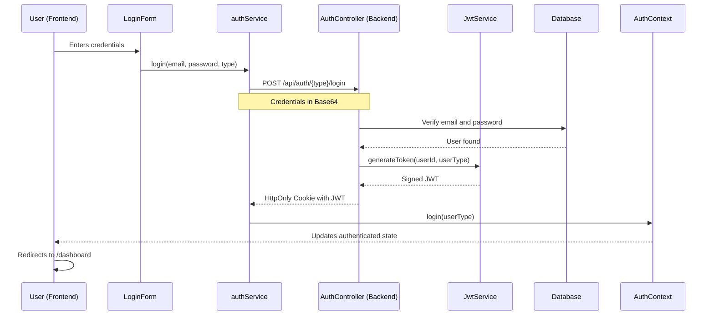

# JWT Authentication in Blood4Life

## Introduction

The authentication system in Blood4Life uses **JSON Web Tokens (JWT)** to verify user identity and protect application routes. The system supports two user types:
- **Blood Donors**
- **Hospitals**

Each user type has its own credentials and specific permissions within the system.

## What is JWT?

JSON Web Token (JWT) is an open standard (RFC 7519) that defines a compact and self-contained way for securely transmitting information between parties as a JSON object. This information can be verified and trusted because it is digitally signed.

In Blood4Life, JWTs are used to:
- Authenticate users after login.
- Maintain stateless sessions.
- Protect API endpoints.
- Differentiate between user types (donors vs. hospitals).

## Authentication System Architecture

### General Authentication Flow



## Detailed Authentication Flow

### 1. Login

The user accesses the login page (`/login`) where they find a form with:
- **Email**: Text field for the user's email.
- **Password**: Text field with show/hide option.
- **User Type**: Radio selector to choose between "Donor" or "Hospital".

### 2. Sending Credentials to the Backend

When the user clicks "Submit", the frontend (`LoginForm.tsx`) processes the form:

```typescript
// LoginForm.tsx - Submit handling
const handleSubmit = async (e: React.FormEvent) => {
  e.preventDefault();
  setError(null);
  setIsLoading(true);

  try {
    await authService.login(formData.username, formData.password, userType);
    login(userType);
    navigate('/dashboard');
  } catch (err: any) {
    setError(err.response?.data?.error || 'Login failed');
  } finally {
    setIsLoading(false);
  }
};
```

The `authService` encodes the credentials in **Base64** following the HTTP Basic Authentication format:

```typescript
// authService.ts - Credential encoding
export const authService = {
  login: async (email: string, password: string, type: 'bloodDonor' | 'hospital' | 'admin') => {
    const credentials = btoa(`${email}:${password}`); // Base64 encoding
    const response = await axios.post<LoginResponse>(
      `${API_URL}/auth/${type}/login`,
      {},
      {
        headers: {
          Authorization: `Basic ${credentials}`,
        },
        withCredentials: true // Crucial: allows receiving cookies
      }
    );
    return response.data;
  }
};
```

### 3. Verification in the Backend

The `AuthController` receives the request and processes the credentials:

```java
// AuthController.java - Donor Login
@PostMapping("/bloodDonor/login")
public ResponseEntity<?> loginBloodDonor(@RequestHeader("Authorization") String authHeader) {
  try {
    String[] credentials = extractCredentials(authHeader);
    String email = credentials[0];
    String password = credentials[1];

    Optional<BloodDonor> donorOpt = bloodDonorService.findByEmail(email);
    if (donorOpt.isEmpty() || !passwordEncoder.matches(password, donorOpt.get().getPassword())) {
      return errorResponse("Invalid credentials", HttpStatus.UNAUTHORIZED);
    }

    BloodDonor donor = donorOpt.get();
    String token = jwtService.generateToken(donor.getId(), "bloodDonor");
    
    // ... cookie creation and response
  }
}
```

### 4. JWT Generation

If the credentials are valid, `JwtServiceImpl` generates a JWT token:

```java
// JwtServiceImpl.java - Token Generation
@Override
public String generateToken(Integer EntityId, String entityType) {
  Map<String, Object> claims = new HashMap<>();
  claims.put("id", EntityId);      // User ID
  claims.put("type", entityType);  // Type: "bloodDonor" or "hospital"

  return Jwts.builder()
    .claims(claims)
    .issuedAt(new Date(System.currentTimeMillis()))
    .expiration(new Date(System.currentTimeMillis() + EXPIRATION_TIME)) // 1 hour
    .signWith(this.getSigningKey(), Jwts.SIG.HS256)
    .compact();
}
```

**Token Components:**
- **Claims (payload)**: Contains `id` and `type`.
- **issuedAt**: Token issuance timestamp.
- **expiration**: Expiration timestamp (1 hour from issuance).
- **Signature**: Generated using HMAC-SHA256 with the secret key.

### 5. Sending the JWT Cookie

The backend creates an **HttpOnly** cookie with the token and sends it to the client:

```java
// AuthController.java - JWT Cookie Creation
ResponseCookie jwtCookie = ResponseCookie.from("jwt", token)
    .httpOnly(true)        // Not accessible from JavaScript
    .secure(false)         // Should be true in production (HTTPS)
    .path("/")            // Available application-wide
    .maxAge(24 * 60 * 60) // 24 hours
    .sameSite("Lax")      // CSRF Protection
    .build();

return ResponseEntity.ok()
    .header(HttpHeaders.SET_COOKIE, jwtCookie.toString())
    .body(response);
```

### 6. Storage and Management in the Frontend

The browser automatically stores the JWT cookie. `AuthContext` manages the authentication state:

```typescript
// AuthContext.tsx - Auth state management
export const AuthProvider: React.FC<{ children: ReactNode }> = ({ children }) => {
  // ... state definitions

  // Verify auth on app load
  useEffect(() => {
    const checkAuth = async () => {
      try {
        await axiosInstance.get('/bloodDonor/me');
        setUserType('bloodDonor');
        setIsAuthenticated(true);
      } catch (e) {
        setIsAuthenticated(false);
        setUserType(null);
      } finally {
        setIsLoading(false);
      }
    };
    checkAuth();
  }, []);
  
  // ...
};
```

### 7. JWT Validation on Subsequent Requests

Every time the frontend makes a request to a protected route, the browser automatically sends the JWT cookie. `JwtAuthFilter` intercepts the request:

```java
// JwtAuthFilter.java - Auth Filter
@Override
protected void doFilterInternal(...) {
  String token = extractTokenFromCookie(request);

  if (token == null) {
    chain.doFilter(request, response);
    return;
  }

  try {
    Claims userTokenPayload = jwtService.extractPayload(token);
    // ... extract ID and Type
    
    // Authenticate based on user type
    if (userId != null && SecurityContextHolder.getContext().getAuthentication() == null) {
       // ... set authentication in SecurityContext
    }
  } catch (Exception e) {
    SecurityContextHolder.clearContext();
  }

  chain.doFilter(request, response);
}
```

## Security Measures Implemented

### 1. Password Encryption
Passwords are hashed using **BCrypt**.

### 2. HttpOnly Cookies
JWT cookies are `HttpOnly`, meaning they are **not accessible via client-side JavaScript**, preventing **XSS (Cross-Site Scripting)** attacks.

### 3. Token Expiration
JWTs have a **1-hour** expiration time.

### 4. SameSite Cookie Attribute
The cookie uses `SameSite="Lax"` to protect against **CSRF (Cross-Site Request Forgery)** attacks.

### 5. Stateless Sessions
Spring Security is configured not to create sessions (`SessionCreationPolicy.STATELESS`), making every request independent.

### 6. Digital Signature
Tokens are signed with **HMAC-SHA256**.

## Production Considerations

### 🔴 Areas for Improvement in Production:

1. **Secure Cookie:** Enable `.secure(true)` (requires HTTPS).
2. **Refresh Tokens:** Implement refresh tokens to renew expired tokens without re-login.
3. **Secret Key in Environment Variables:** Move the JWT secret key to environment variables.
4. **Logging and Monitoring:** Log failed login attempts.
5. **Rate Limiting:** Limit login attempts per IP.
6. **Token Blacklist:** Implement a revocation list for logout/password changes.

## Testing Authentication

### Test Credentials

**Hospital:**
- Email: `test@hospital.es`
- Password: `Test12345`

**Blood Donor:**
- Email: `test@donante.com`
- Password: `Test12345`

### Verification Steps

1. Navigate to `/login`.
2. Enter credentials.
3. Verify redirection to dashboard.
4. Check Developer Tools -> Application -> Cookies for the `jwt` cookie.
5. Click "Logout" and verify the cookie is removed.
