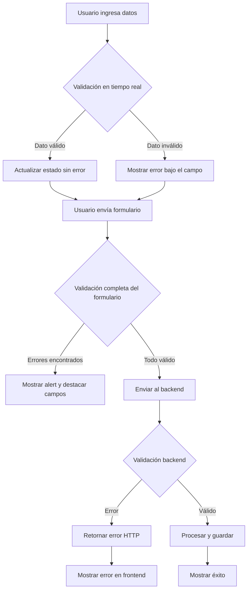
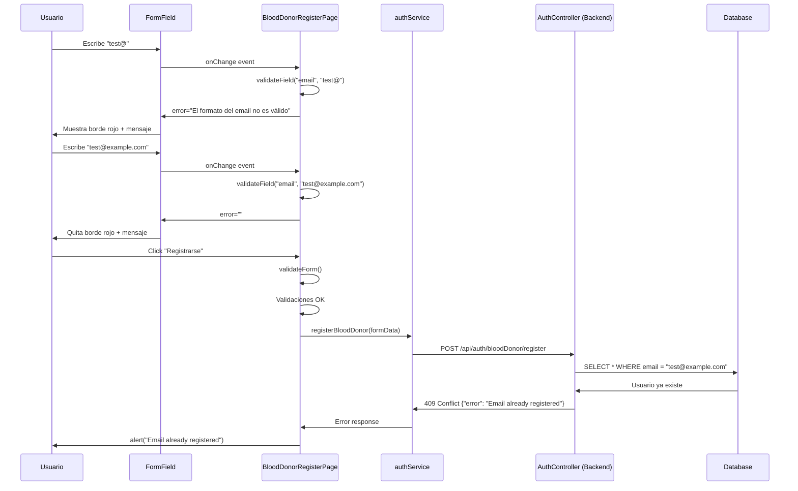

# Validaciones y Feedback hacia el Usuario en Blood4Life

## Introducción

En Blood4Life, las validaciones de datos y el feedback claro al usuario son fundamentales para:
- **Garantizar la integridad de los datos** almacenados en la base de datos
- **Mejorar la experiencia del usuario** mediante feedback inmediato y descriptivo
- **Reducir errores** al prevenir el envío de datos inválidos
- **Cumplir con requisitos de negocio** (edad mínima, formatos específicos, etc.)

El sistema implementa una **estrategia de defensa en profundidad** con validaciones tanto en el frontend (React/TypeScript) como en el backend (Spring Boot/Java).

## Arquitectura de Validaciones



##

 Validaciones en el Frontend

### 1. Validación en Tiempo Real (onChange)

El frontend implementa **validación instantánea** mientras el usuario escribe. Cada vez que un campo cambia, se valida inmediatamente y se muestra feedback visual.

#### Implementación en BloodDonorRegisterPage

```typescript
// BloodDonorRegisterPage.tsx - Manejo de cambios en inputs
const handleInputChange = (e: React.ChangeEvent<HTMLInputElement>) => {
  const { name, value } = e.target;

  // Actualizar el estado del formulario
  setFormData(prev => ({
    ...prev,
    [name]: value
  }));

  // Validar el campo inmediatamente
  const error = validateField(name, value);
  setErrors(prev => ({
    ...prev,
    [name]: error
  }));
};
```

Esta función:
1. **Actualiza** el valor del campo en el estado
2. **Valida** el nuevo valor con `validateField`
3. **Actualiza** el estado de errores para ese campo específico

#### Función de Validación por Campo

La función `validateField` contiene toda la lógica de validación específica para cada tipo de campo:

```typescript
// BloodDonorRegisterPage.tsx - Validación de campo individual
const validateField = (name: string, value: string): string => {
  switch (name) {
    case 'dni':
      if (!value.trim()) return 'El DNI es obligatorio';
      if (!/^[0-9]{8}[A-Z]$/.test(value)) 
        return 'Formato de DNI inválido (8 números + 1 letra)';
      return '';

    case 'firstName':
      if (!value.trim()) return 'El nombre es obligatorio';
      if (value.trim().length < 2) 
        return 'El nombre debe tener al menos 2 caracteres';
      return '';

    case 'lastName':
      if (!value.trim()) return 'Los apellidos son obligatorios';
      if (value.trim().length < 2) 
        return 'Los apellidos deben tener al menos 2 caracteres';
      return '';

    case 'email':
      if (!value.trim()) return 'El email es obligatorio';
      if (!/^[^\s@]+@[^\s@]+\.[^\s@]+$/.test(value)) 
        return 'El formato del email no es válido';
      return '';

    case 'phoneNumber':
      if (!value.trim()) return 'El teléfono es obligatorio';
      const digitsOnly = value.replace(/\D/g, '');
      if (digitsOnly.length < 9) 
        return 'El teléfono debe tener al menos 9 dígitos';
      return '';

    case 'dateOfBirth': {
      if (!value.trim()) return 'La fecha de nacimiento es obligatoria';
      const birthDate = new Date(value);
      const today = new Date();
      const age = today.getFullYear() - birthDate.getFullYear();
      const monthDiff = today.getMonth() - birthDate.getMonth();

      if (monthDiff < 0 || (monthDiff === 0 && today.getDate() < birthDate.getDate())) {
        if (age - 1 < 18) return 'Debes ser mayor de 18 años';
      } else {
        if (age < 18) return 'Debes ser mayor de 18 años';
      }

      if (birthDate > today) return 'La fecha no puede ser futura';
      return '';
    }

    case 'password':
      if (!value.trim()) return 'La contraseña es obligatoria';
      if (value.length < 8) 
        return 'La contraseña debe tener al menos 8 caracteres';
      return '';

    default:
      return '';
  }
};
```

#### Ejemplo Visual: Errores de Validación

Cuando el usuario ingresa datos inválidos, se muestran mensajes de error debajo de cada campo:


#### Ejemplo Visual: Error Corregido

Cuando el usuario corrige el dato, el mensaje de error desaparece inmediatamente:


### 2. Validaciones Avanzadas en HospitalRegisterPage

El formulario de registro de hospitales tiene validaciones más complejas:

#### Validación de CIF

```typescript
case 'cif':
  if (!value.trim()) return 'El CIF es obligatorio';
  if (!/^[A-Za-z0-9]{8,10}$/.test(value)) 
    return 'El CIF debe tener entre 8 y 10 caracteres alfanuméricos';
  if (!/^[A-Za-z]/.test(value)) 
    return 'El CIF debe comenzar con una letra';
  return '';
```

#### Validación de Nombre de Hospital

```typescript
case 'name':
  if (!value.trim()) return 'El nombre es obligatorio';
  if (value.trim().length < 2) 
    return 'El nombre debe tener al menos 2 caracteres';
  if (value.trim().length > 100) 
    return 'El nombre no puede exceder 100 caracteres';
  if (!/^[a-zA-ZáéíóúÁÉÍÓÚñÑüÜ\s\-.&()]+$/.test(value)) 
    return 'El nombre solo puede contener letras, espacios y los caracteres .-&()';
  if (/[0-9]/.test(value)) 
    return 'El nombre no puede contener números';
  if (/(.)\/1{4,}/.test(value)) 
    return 'Demasiados caracteres repetidos';
  return '';
```

#### Validación Compleja de Dirección

```typescript
case 'address':
  if (!value.trim()) return 'La dirección es obligatoria';
  if (value.trim().length < 10) 
    return 'La dirección debe tener al menos 10 caracteres';
  if (value.trim().length > 200) 
    return 'La dirección no puede exceder 200 caracteres';
  
  // Debe contener caracteres válidos
  if (!/^[a-zA-Z0-9áéíóúÁÉÍÓÚñÑüÜ\s\-.,#ºª°/:()&]+$/.test(value)) 
    return 'La dirección contiene caracteres no válidos';
  
  // Debe incluir un número
  if (!/\d/.test(value)) 
    return 'La dirección debe incluir un número';
  
  // Debe incluir nombre de calle válido
  const words = value.trim().split(/\s+/).filter(word => /[a-zA-Z]{3,}/.test(word));
  if (words.length === 0) 
    return 'La dirección debe incluir el nombre de una calle válido';
  
  // Debe tener formato reconocible
  const commonPatterns = [
    /^(Calle|Avenida|Av\.|Plaza|Paseo|Camino|Travesía|C\/)\s+[a-zA-Z]/,
    /^[a-zA-Z]+\s+[a-zA-Z]+\s+\d+/,
    /^\d+\s+[a-zA-Z]+/,
    /^[a-zA-Z]+\s+\d+/,
  ];
  const isValidFormat = commonPatterns.some(pattern => pattern.test(value.trim()));
  if (!isValidFormat) 
    return 'Formato de dirección no reconocido. Ejemplos: "Calle Mayor 123", "Av. Constitución 45"';
  
  return '';
```

####Validación Robusta de Contraseña

```typescript
case 'password':
  if (!value.trim()) return 'La contraseña es obligatoria';
  if (value.length < 8) 
    return 'La contraseña debe tener al menos 8 caracteres';
  if (value.length > 32) 
    return 'La contraseña no puede exceder 32 caracteres';
  if (!/(?=.*[a-z])/.test(value)) 
    return 'La contraseña debe contener al menos una minúscula';
  if (!/(?=.*[A-Z])/.test(value)) 
    return 'La contraseña debe contener al menos una mayúscula';
  if (!/(?=.*\d)/.test(value)) 
    return 'La contraseña debe contener al menos un número';
  if (!/^[a-zA-Z0-9!@#$%^&*()_+\-=[\]{};':|,.<>/?]*$/.test(value)) 
    return 'La contraseña contiene caracteres no permitidos';
  if (/\s/.test(value)) 
    return 'La contraseña no puede contener espacios';
  if (/(.)\/1{3,}/.test(value)) 
    return 'Demasiados caracteres repetidos';
  return '';
```

### 3. Validación Completa al Enviar el Formulario

Antes de enviar los datos al backend, se validan todos los campos del formulario:

```typescript
// BloodDonorRegisterPage.tsx - Validación completa
const validateForm = (): boolean => {
  const newErrors: ValidationErrors = {};

  // Validar cada campo del formulario
  Object.keys(formData).forEach(key => {
    const error = validateField(key, formData[key as keyof BloodDonorFormData] as string);
    if (error) {
      newErrors[key as keyof ValidationErrors] = error;
    }
  });

  // Actualizar estado de errores
  setErrors(newErrors);
  
  // Retornar true si no hay errores
  return Object.keys(newErrors).length === 0;
};

const handleRegister = async (e: React.FormEvent) => {
  e.preventDefault();

  // Validar todo el formulario
  if (!validateForm()) {
    alert("Por favor, corrige los errores en el formulario");
    return;
  }

  setLoading(true);
  // ... envío de datos al backend
};
```

### 4. Componentes de Feedback Visual

#### FormField Component

El componente `FormField` es reutilizable y muestra errores de validación de forma consistente:

```tsx
// FormField.tsx
interface FormFieldProps {
  type?: 'text' | 'email' | 'password' | 'tel' | 'number' | 'date';
  id: string;
  name: string;
  label: string;
  value: string;
  onChange: (e: React.ChangeEvent<HTMLInputElement>) => void;
  required?: boolean;
  disabled?: boolean;
  error?: string;  // Mensaje de error a mostrar
  placeholder?: string;
  // ... otras props
}

const FormField: React.FC<FormFieldProps> = ({
  type = 'text',
  id,
  name,
  label,
  value,
  onChange,
  required = false,
  disabled = false,
  error,
  placeholder,
  // ...
}) => {
  return (
    <div className={`w-full ${containerClass}`}>
      <label htmlFor={id} className="block font-poppins font-medium text-body-sm md:text-body text-black mb-1">
        {label}
      </label>

      <input
        type={type}
        id={id}
        name={name}
        value={value}
        onChange={onChange}
        required={required}
        disabled={disabled}
        // Borde rojo si hay error
        className={`w-full ... ${error ? 'border-red-500' : 'border-gray-300'}`}
        placeholder={placeholder}
      />

      {/* Mensaje de error en rojo */}
      {error && <p className="font-roboto text-red-500 text-caption mt-1">{error}</p>}
    </div>
  );
};
```

**Características visuales:**
- **Borde rojo** (`border-red-500`) cuando hay un error
- **Mensaje de error** en texto rojo debajo del campo
- **Tipografía** consistente con el sistema de diseño

#### SelectField Component

Similar a `FormField`, pero para campos de selección:

```tsx
// SelectField.tsx
const SelectField: React.FC<SelectFieldProps> = ({
  id,
  name,
  label,
  value,
  onChange,
  required = false,
  disabled = false,
  error,
  options,
  // ...
}) => {
  return (
    <div className={`w-full ${containerClass}`}>
      <label htmlFor={id} className="block font-poppins font-medium text-body-sm md:text-body text-black mb-1">
        {label}
      </label>

      <select
        id={id}
        name={name}
        value={value}
        onChange={onChange}
        required={required}
        disabled={disabled}
        className={`w-full ... ${error ? 'border-red-500' : 'border-gray-300'}`}
      >
        {options.map(option => (
          <option key={option.value} value={option.value}>
            {option.label}
          </option>
        ))}
      </select>

      {error && <p className="font-roboto text-red-500 text-caption mt-1">{error}</p>}
    </div>
  );
};
```

### 5. Estados de Carga (Loading States)

Durante el envío del formulario, se muestra un estado de carga para informar al usuario:

```tsx
// BloodDonorRegisterPage.tsx - Botón con estado de carga
<Button
  type="submit"
  disabled={loading}
  className="px-6 py-3 text-body-sm w-full sm:flex-1 sm:max-w-48"
>
  {loading ? (
    <>
      <svg className="animate-spin -ml-1 mr-2 h-4 w-4 text-white" fill="none" viewBox="0 0 24 24">
        <circle className="opacity-25" cx="12" cy="12" r="10" stroke="currentColor" strokeWidth="4"></circle>
        <path className="opacity-75" fill="currentColor"
          d="M4 12a8 8 0 018-8V0C5.373 0 0 5.373 0 12h4zm2 5.291A7.962 7.962 0 014 12H0c0 3.042 1.135 5.824 3 7.938l3-2.647z"></path>
      </svg>
      Procesando...
    </>
  ) : 'Registrarse'}
</Button>
```

**Características:**
- **Spinner animado** mientras se procesa
- **Texto "Procesando..."** para indicar actividad
- **Botón deshabilitado** para prevenir múltiples envíos

## Validaciones en el Backend

### 1. Anotación @Valid en Controladores

Spring Boot utiliza la anotación `@Valid` para validar objetos automáticamente:

```java
// HospitalController.java
@PostMapping
public ResponseEntity<HospitalDTO> addHospital(@Valid @RequestBody Hospital newHospital) {
  // Si la validación falla, Spring retorna 400 Bad Request automáticamente
  // ...
}

@PutMapping
public ResponseEntity<?> updateHospital(@Valid @RequestBody Hospital updatedHospital) {
  // ...
}
```

### 2. Validación Manual en AuthController

El `AuthController` realiza validaciones manuales y devuelve errores específicos:

#### Validación de Email Duplicado

```java
// AuthController.java - Registro de donante
@PostMapping("/bloodDonor/register")
public ResponseEntity<?> registerBloodDonor(/* parámetros */) {
  try {
    // Validar email único
    if (bloodDonorService.findByEmail(email).isPresent()) {
      return errorResponse("Email already registered", HttpStatus.CONFLICT);
    }
    
    // ... resto del registro
  } catch (Exception e) {
    return errorResponse(e.getMessage(), HttpStatus.INTERNAL_SERVER_ERROR);
  }
}
```

#### Validación de Credenciales

```java
// AuthController.java - Login
@PostMapping("/bloodDonor/login")
public ResponseEntity<?> loginBloodDonor(@RequestHeader("Authorization") String authHeader) {
  try {
    String[] credentials = extractCredentials(authHeader);
    String email = credentials[0];
    String password = credentials[1];

    Optional<BloodDonor> donorOpt = bloodDonorService.findByEmail(email);
    
    // Validar credenciales
    if (donorOpt.isEmpty() || !passwordEncoder.matches(password, donorOpt.get().getPassword())) {
      return errorResponse("Error. Ingrese credenciales válidas", HttpStatus.UNAUTHORIZED);
    }
    
    // ... generar JWT
  } catch (IllegalArgumentException e) {
    return errorResponse(e.getMessage(), HttpStatus.BAD_REQUEST);
  }
}
```

#### Método de Respuesta de Error

```java
// AuthController.java - Respuesta de error estandarizada
private ResponseEntity<Map<String, String>> errorResponse(String message, HttpStatus status) {
  return ResponseEntity.status(status).body(Map.of("error", message));
}
```

### 3. Códigos de Estado HTTP

El backend utiliza códigos HTTP semánticos:

| Código | Nombre | Uso en Blood4Life |
|--------|--------|-------------------|
| **200** | OK | Operación exitosa |
| **201** | Created | Recurso creado exitosamente |
| **400** | Bad Request | Datos inválidos o faltantes |
| **401** | Unauthorized | Credenciales incorrectas |
| **409** | Conflict | Email ya registrado |
| **500** | Internal Server Error | Error inesperado del servidor |

### 4. Validación de Autorización (Header)

```java
// AuthController.java
private String[] extractCredentials(String authHeader) {
  if (authHeader == null || !authHeader.startsWith("Basic ")) {
    throw new IllegalArgumentException("Missing or invalid Authorization header");
  }
  String base64Credentials = authHeader.substring("Basic ".length());
  String decodedString = new String(Base64.getDecoder().decode(base64Credentials));
  if (!decodedString.contains(":")) {
    throw new IllegalArgumentException("Invalid Basic Auth format. Expected 'email:password'");
  }
  return decodedString.split(":", 2);
}
```

## Integración Frontend-Backend

### Manejo de Errores del Backend en el Frontend

El frontend captura errores HTTP del backend y los muestra al usuario:

```typescript
// LoginForm.tsx - Manejo de errores de login
const handleSubmit = async (e: React.FormEvent) => {
  e.preventDefault();
  setError(null);
  setLoading(true);

  try {
    await authService.login(formData.username, formData.password, userType);
    login(userType);
    navigate('/dashboard');
  } catch (err: any) {
    console.error(err);
    // Extraer mensaje de error del backend
    setError(err.response?.data?.error || 'Error al iniciar sesión. Verifique sus credenciales.');
  } finally {
    setLoading(false);
  }
};
```

```typescript
// BloodDonorRegisterPage.tsx - Manejo de errores de registro
authService.registerBloodDonor(submitData)
  .then((response) => {
    console.log("Registro exitoso:", response.data);
    alert("Donante registrado correctamente");
    resetForm();
    setSelectedImage(null);
  })
  .catch((err) => {
    console.error("Error registrando donante:", err);
    // Mostrar error del backend o mensaje genérico
    alert(err.response?.data?.error || "Error al registrar");
  })
  .finally(() => {
    setLoading(false);
  });
```

### Ejemplo de Flujo Completo



## Mejores Prácticas Implementadas

### 1. Validación en Ambos Lados

- ✅ **Frontend:** Feedback inmediato, mejor UX
- ✅ **Backend:** Seguridad, integridad de datos

> **Nunca confiar solo en validaciones del frontend**: Un usuario malicioso puede bypassear JavaScript, por eso el backend siempre valida.

### 2. Mensajes Descriptivos

Los mensajes de error son:
- **Específicos:** "La contraseña debe tener al menos 8 caracteres"
- **Accionables:** Indican qué hacer para corregir el error
- **En español:** Idioma del usuario objetivo

### 3. Validación Progresiva

- **onChange:** Validación en tiempo real para cada campo
- **onSubmit:** Validación completa antes de enviar
- **Backend:** Validación final y definitiva

### 4. Feedback Visual Consistente

- **Bordes rojos** para campos con error
- **Mensajes bajo el campo** en rojo
- **Iconos** (ojo para mostrar/ocultar contraseña)
- **Spinners** durante la carga

### 5. Estados de Carga

- **Botones deshabilitados** durante el procesamiento
- **Spinners** para indicar actividad
- **Texto dinámico** ("Registrarse" → "Procesando...")

### 6. Expresiones Regulares (Regex)

El sistema usa regex para validar formatos complejos:

- **DNI:** `/^[0-9]{8}[A-Z]$/` - 8 dígitos + 1 letra
- **Email:** `/^[^\s@]+@[^\s@]+\.[^\s@]+$/` - formato básico de email
- **Teléfono:** `/^(\+?\d{1,3}[-.\s]?)?\(?\d{1,4}\)?[-.\s]?\d{1,4}[-.\s]?\d{1,9}$/`
- **Dirección:** `/^(Calle|Avenida|Av\.|Plaza|Paseo|Camino|Travesía|C\/)\s+[a-zA-Z]/`

## Tipos de Validaciones Implementadas

### Validaciones de Formato

- Email con formato válido
- Teléfono con mínimo 9 dígitos
- DNI con 8 números + 1 letra
- CIF con 8-10 caracteres alfanuméricos

### Validaciones de Contenido

- Nombre sin números
- Dirección con nombre de calle y número
- Contraseña con mayúsculas, minúsculas y números

### Validaciones de Longitud

- Nombre: mínimo 2 caracteres
- Contraseña: 8-32 caracteres
- Dirección: 10-200 caracteres

### Validaciones de Negocio

- Edad mínima de 18 años para donantes
- Email único (no duplicado)
- Fecha de nacimiento no futura

### Validaciones de Seguridad

- Contraseña sin espacios
- Contraseña sin caracteres repetidos excesivamente
- Prevención de inyección de caracteres especiales

## Conclusión

El sistema de validaciones de Blood4Life implementa:

✅ **Validación en tiempo real** para feedback inmediato  
✅ **Validación completa al enviar** para asegurar integridad  
✅ **Validación en backend** para seguridad  
✅ **Mensajes descriptivos** en español  
✅ **Feedback visual consistente** con componentes reutilizables  
✅ **Estados de carga** para mejor UX  
✅ **Manejo robusto de errores** del backend  
✅ **Código DRY** con funciones reutilizables (`validateField`, `FormField`, etc.)

Esta arquitectura garantiza que los datos almacenados en la base de datos sean válidos, consistentes y seguros, mientras proporciona una experiencia de usuario fluida y clara.
